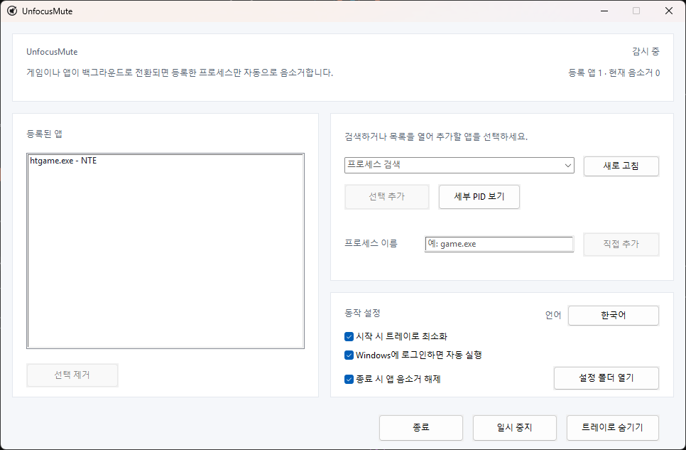

<div align="center">
  

  <h1>UnfocusMute</h1>

  <p><strong>Lightweight, portable, fully local Windows tray app that mutes selected games and apps when they lose focus.<br>Restores only the audio it muted — no network, no logs.</strong></p>

  <p>
    한국어 · <a href="docs/README_en.md">English</a> · <a href="docs/README_ja.md">日本語</a> · <a href="docs/README_zh-CN.md">简体中文</a> · <a href="docs/README_es.md">Español</a> · <a href="docs/README_fr.md">Français</a> · <a href="docs/README_pt.md">Português</a> · <a href="docs/README_hi.md">हिन्दी</a> · <a href="docs/README_ar.md">العربية</a>
  </p>

  <p>
    <a href="https://github.com/ilsd7/UnfocusMute/actions/workflows/ci.yml"></a>
    
    <a href="LICENSE"></a>
  </p>

  <p>완전한 로컬 실행 &nbsp;·&nbsp; 네트워크 연결 없음 &nbsp;·&nbsp; 로그 파일 없음 &nbsp;·&nbsp; 관리자 권한 불필요</p>

  <p>
    <a href="https://github.com/ilsd7/UnfocusMute/releases/latest/download/UnfocusMute-windows-x64.zip">다운로드</a>
    · <a href="#사용-방법">사용 방법</a>
    · <a href="#보안-및-개인정보">개인정보</a>
    · <a href="LICENSE">Apache-2.0</a>
  </p>
</div>

---

UnfocusMute는 선택한 게임이나 앱이 백그라운드로 전환될 때 그 앱의 소리만 자동으로 음소거하는 작고 가벼운 Windows용 트레이 앱입니다. 게임뿐 아니라 브라우저, 메신저, 런처, 미디어 플레이어처럼 Windows 오디오 세션으로 표시되는 일반 앱도 등록할 수 있습니다.

Rust 네이티브 앱으로 빌드되어 별도 런타임 없이 바로 실행됩니다. 릴리스 빌드는 작은 실행 파일 크기를 우선하도록 구성되어 있습니다.

<p align="center">
  
</p>

음소거와 복원 모두 UnfocusMute가 직접 건드린 세션에만 적용되며, 사용자가 원래 음소거해 둔 세션은 건드리지 않습니다.

---

## 이런 경우에 유용합니다

- 게임이나 앱을 켜 둔 채 Alt+Tab으로 다른 창을 자주 오갈 때
- 자체 백그라운드 음소거 옵션이 없는 게임이나 앱을 조용히 두고 싶을 때
- 백그라운드 게임 소리만 끄고 브라우저나 통화 앱은 그대로 듣고 싶을 때
- 같은 `.exe`가 여러 프로세스로 실행되어 앱 단위 관리와 특정 PID 제어를 함께 써야 할 때

## 주요 기능

- 등록한 앱이 백그라운드에 있을 때 오디오 세션을 자동으로 음소거하고, 전면으로 돌아오면 복원
- 실행 중인 앱 목록에서 선택해 추가하거나 `game.exe` 형식으로 직접 입력
- `.exe` 단위 등록, 현재 실행 중인 인스턴스용 개별 PID 등록, `세부 PID 보기` 지원
- 등록 앱별 메모와 대상별 실시간 음소거 상태 표시, 앱별 `자동 음소거 제외` 및 `자동 음소거에 포함`
- 트레이 상주, 트레이 상태 요약, 전체 일시 중지, 설정 폴더 열기, 중복 실행 방지
- 첫 실행 시 언어 선택, 이후 앱 안에서 English/한국어/日本語/简体中文/Español/Français/Português/हिन्दी/العربية 즉시 전환
- 설정은 `%APPDATA%\UnfocusMute\config.json`에 로컬 저장

---

## 설치 및 실행

Windows 10/11에서는 배포 ZIP을 다운로드해 압축을 풀면 바로 사용할 수 있습니다.

| 최신 배포 파일 |
| --- |
| [UnfocusMute-windows-x64.zip](https://github.com/ilsd7/UnfocusMute/releases/latest/download/UnfocusMute-windows-x64.zip) |
| [SHA-256 확인 파일](https://github.com/ilsd7/UnfocusMute/releases/latest/download/UnfocusMute-windows-x64.zip.sha256) · [릴리스 노트](https://github.com/ilsd7/UnfocusMute/releases/latest) |

압축을 푼 `UnfocusMute-windows-x64` 폴더를 원하는 위치로 옮긴 다음, 폴더 안의 `UnfocusMute-v<version>.exe`를 실행하면 됩니다. 포터블 실행 파일이라 별도 설치 과정이 없으며, Rust, Visual Studio Build Tools, MinGW 같은 개발 도구도 필요하지 않습니다.

> **참고:** 비용 문제로 인해 코드 서명 인증서가 없어 처음 실행할 때 Windows SmartScreen 또는 "알 수 없는 게시자" 경고가 뜰 수 있습니다. 파일의 무결성을 직접 확인하고 싶다면 [배포 파일 검증](#배포-파일-검증) 섹션을 참고하세요.

## 사용 전 참고 사항

UnfocusMute는 Windows가 제공하는 프로세스 이름, 전면 창 정보, CoreAudio 세션을 기준으로 동작합니다. 앱이 아직 오디오 세션을 생성하지 않았거나, 드라이버·권한·보안 프로그램이 세션 접근을 제한하는 경우 목록 표시나 음소거 제어가 일부 제한될 수 있습니다.

PID 등록 시에는 한 가지 동작 방식을 알아두세요. Windows는 오디오 세션 PID와 전면 창 PID를 항상 같은 값으로 제공하지 않습니다. 이를 보정하기 위해 UnfocusMute는 등록한 PID의 `.exe` 이름과 현재 전면 창의 `.exe` 이름이 같으면 해당 앱이 전면으로 돌아온 것으로 처리합니다. 따라서 같은 `.exe`를 여러 개 동시에 실행한 환경에서는 특정 PID만 완벽하게 구분하지 못할 수 있으며, 다른 인스턴스가 전면에 있어도 소리가 복원될 수 있습니다.

UnfocusMute는 게임에 코드를 주입하거나, 게임 메모리를 읽거나, 입력을 후킹하거나, 게임 파일을 수정하지 않습니다. Windows의 프로세스·전면 창 정보와 CoreAudio 세션 음소거 기능만 사용하므로 대부분의 안티치트와 충돌하지 않을 것으로 예상하지만, 모든 안티치트와의 호환성을 보장하지는 않습니다.

## 사용 방법

1. UnfocusMute를 실행합니다.
2. 첫 실행 시 언어 선택 창이 나타납니다. 원하는 언어를 고르세요. 기본값은 English입니다.
3. 음소거 대상으로 등록할 게임이나 앱을 실행합니다.
4. `프로세스 검색` 목록을 열거나 검색어를 입력한 뒤 항목을 선택하고 `선택 추가`를 누릅니다.
5. 특정 PID만 등록하려면 `세부 PID 보기`를 눌러 개별 항목을 선택합니다. PID 등록은 현재 실행 중인 인스턴스에만 유효하므로, 앱을 다시 실행해 PID가 바뀌면 다시 선택해야 합니다.
6. 등록된 앱을 마우스 오른쪽 버튼으로 클릭하면 메모를 편집하거나 해당 앱을 `자동 음소거 제외`로 설정할 수 있습니다.
7. 창을 닫아도 앱은 트레이에 남아 계속 동작합니다. 완전히 종료하려면 `종료`를 누르세요.

## 등록 앱 메모 활용하기

프로세스 이름만으로는 어떤 앱인지 헷갈릴 때, 등록된 앱을 마우스 오른쪽 버튼으로 클릭하고 `메모 편집`을 선택하세요. 메모는 등록 목록에서 프로세스 이름 옆에 표시되며, 감시 대상 판정에는 영향을 주지 않습니다.

같은 게임 런처가 여러 프로세스를 띄우거나, 이름만 봐서는 용도를 알기 어려운 실행 파일을 등록할 때 특히 유용합니다.

- `htgame.exe - NTE`
- `chrome.exe (PID 18432) - 음악 재생용 프로필`
- `game.exe (PID 21976) - 테스트 서버 클라이언트`
- `launcher.exe - 실제 게임 실행 전 런처`

메모는 다른 설정과 함께 `%APPDATA%\UnfocusMute\config.json`에 로컬로 저장됩니다.

## 게임 실행 파일 이름 확인하기

등록할 이름이 헷갈릴 때는 작업 관리자에서 `.exe` 파일 이름을 직접 확인하세요.

1. 게임을 먼저 실행합니다.
2. `Alt`+`Tab` 또는 `Windows`+`Tab`으로 Windows 바탕화면으로 돌아옵니다.
3. `Ctrl`+`Shift`+`Esc`를 눌러 작업 관리자를 엽니다.
4. 프로세스 목록을 `CPU` 순으로 정렬해 방금 실행한 게임을 찾습니다.
5. 해당 항목을 마우스 오른쪽 버튼으로 클릭하고 `속성`을 선택합니다.
6. `game.exe`처럼 `.exe`로 끝나는 실행 파일 이름을 확인한 뒤 UnfocusMute에 등록합니다.

---

## 보안 및 개인정보

UnfocusMute는 완전한 로컬 앱입니다. 모든 동작이 현재 PC 안에서만 이루어지며, 인터넷 연결이 없어도 정상 작동합니다.

**저장하는 것** — 등록한 프로세스 이름, 선택적으로 등록한 PID, UI 언어, 창 위치, 시작 옵션. 이 데이터는 `%APPDATA%\UnfocusMute\config.json`에만 저장되며, 외부로 전송되지 않습니다.

**저장하지 않는 것** — 앱 로그 파일을 생성하지 않습니다. 세션 간 동작 기록은 어디에도 남지 않습니다.

**하지 않는 것** — 네트워크 요청, 텔레메트리, 크래시 리포팅, 원격 로깅이 없습니다. 관리자 권한도 요구하지 않습니다.

오디오 세션 감지와 음소거 제어는 Windows CoreAudio API만 사용하며, 게임 프로세스에 코드를 주입하거나 메모리를 읽지 않습니다.

---

## 배포 파일 검증

보안상 사용자는 개발자가 저장소에 공개된 코드와 다른 파일을 악의적으로 배포하거나, 계정 탈취 등으로 배포 파일이 변조되는 상황에 대비할 수 있어야 합니다. 이를 위해 GitHub Release에 업로드된 파일이 공개된 소스 코드와 일치하는 공식 빌드인지 직접 검증할 수 있는 절차가 필요합니다.

보안과 투명성을 위해 UnfocusMute는 GitHub Release에 업로드된 배포 파일이 이 저장소의 소스 코드와 일치하는 공식 빌드인지 사용자가 직접 확인할 수 있는 검증 방법을 제공합니다.

릴리스 ZIP 파일과 SHA-256 체크섬 파일은 GitHub의 자동 빌드 시스템인 GitHub Actions에서 생성되며, 두 파일 모두 출처 증명을 위한 attestation과 함께 제공됩니다.

아래 명령을 사용하면 GitHub Release에서 다운로드한 ZIP 파일이 이 저장소의 공식 빌드와 동일한지 검증할 수 있습니다.

```powershell
gh attestation verify .\UnfocusMute-windows-x64.zip -R ilsd7/UnfocusMute
gh attestation verify .\UnfocusMute-windows-x64.zip.sha256 -R ilsd7/UnfocusMute
```

---

## 직접 빌드하기

권장 릴리스 타깃은 `x86_64-pc-windows-msvc`입니다.

요구 사항:

- Rust stable
- Visual Studio Build Tools 2022 또는 Visual Studio 2022
- Windows 10/11 SDK

```powershell
rustup target add x86_64-pc-windows-msvc
cargo build --release --target x86_64-pc-windows-msvc --locked
```

릴리스 빌드는 용량을 줄이도록 설정되어 있습니다. `Cargo.toml`의 release 프로필은 심볼 제거, LTO, 단일 codegen unit, `panic = "abort"`, 크기 우선 최적화를 사용합니다.

실행 파일:

```text
target\x86_64-pc-windows-msvc\release\unfocusmute.exe
```

배포 ZIP:

```powershell
powershell -NoProfile -ExecutionPolicy Bypass -File scripts\package-windows.ps1
```

서드파티 라이선스 고지 갱신:

```powershell
cargo about generate about.hbs -c about.toml --locked --offline -o THIRD_PARTY_NOTICES.md
```

결과물은 `dist\UnfocusMute-windows-x64.zip`에 생성되며, 같은 위치에 SHA-256 확인용 `dist\UnfocusMute-windows-x64.zip.sha256`도 함께 만들어집니다. ZIP에는 버전명이 포함된 실행 파일(`UnfocusMute-v<version>.exe`), `LICENSE`, `THIRD_PARTY_NOTICES.md`, `docs` 폴더의 언어별 README `.txt` 문서가 들어 있습니다.

---

## 라이선스

Apache License 2.0. 자세한 내용은 [LICENSE](LICENSE)를 확인하세요.

서드파티 Rust crate 라이선스 고지는 [THIRD_PARTY_NOTICES.md](THIRD_PARTY_NOTICES.md)를 확인하세요.
