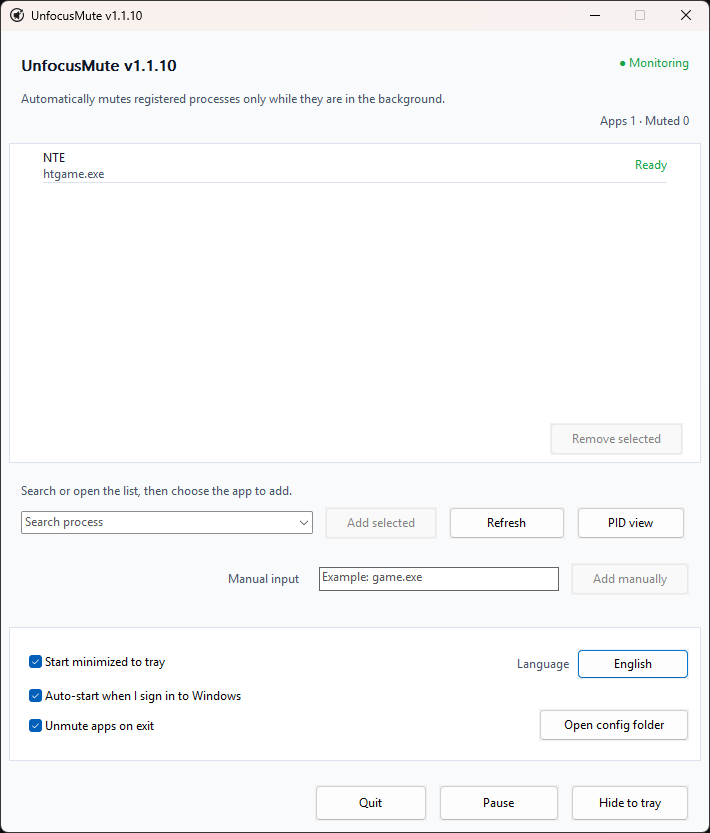

<div align="center">
  

  <h1>UnfocusMute</h1>

  <p><strong>Lightweight Windows tray app that automatically mutes selected games and apps when they lose focus.</strong></p>

  <p>
    English · <a href="docs/README_ko.md">한국어</a> · <a href="docs/README_ja.md">日本語</a> · <a href="docs/README_zh-CN.md">简体中文</a> · <a href="docs/README_es.md">Español</a> · <a href="docs/README_fr.md">Français</a> · <a href="docs/README_pt.md">Português</a> · <a href="docs/README_hi.md">हिन्दी</a> · <a href="docs/README_ar.md">العربية</a>
  </p>

  <p>
    <a href="https://github.com/ilsd7/UnfocusMute/actions/workflows/ci.yml"></a>
    &nbsp;
    
    &nbsp;
    <a href="LICENSE"></a>
  </p>

  <p>Fully local &nbsp;·&nbsp; No network access &nbsp;·&nbsp; No telemetry &nbsp;·&nbsp; No installation required</p>

  <p>
    <a href="https://github.com/ilsd7/UnfocusMute/releases/latest/download/UnfocusMute-windows-x64.zip">Download</a>
    · <a href="#usage">Usage</a>
    · <a href="#security-and-privacy">Privacy</a>
    · <a href="LICENSE">Apache-2.0</a>
  </p>
</div>

---

UnfocusMute is a small, lightweight Windows tray app that automatically mutes selected games and apps when they move into the background, then restores their audio when they return to the foreground.

- Built as a native Rust app, it runs without a separate runtime.
- The executable is currently about 500 KB.
- Muting and restoring apply only to sessions that UnfocusMute changed itself; sessions you muted manually are left alone.

It is not limited to games — you can also register regular apps such as browsers, messengers, launchers, and media players.

<p align="center">
  
</p>

---

## When It Helps

- You often Alt+Tab away from a game or app while leaving it open.
- You want to silence an app that does not have a background mute option.
- You want to mute only a specific app's background audio while multitasking.

## Features

- Automatically mutes registered apps when they move into the background, then restores their audio when they return to the foreground.
- Select an app with an audio session, find it under `All processes`, or type a name such as `game.exe`.
- Register an entire app by `.exe`, or register only one currently running instance by PID.
- Per-app notes, live status, and per-app `Pause` / `Resume`.
- Keeps monitoring from the tray after the window is closed, with tray actions for `Open` / `Hide to tray` / global pause / `Quit`.
- Settings for `Start minimized to tray`, `Auto-start at Windows sign-in`, and `Restore audio muted by UnfocusMute on exit`.
- Choose a language on first run, then switch instantly in-app between 9 languages.

---

## Download and Run

On Windows 10/11, download the ZIP package and extract it to run the app.

| Latest package |
| --- |
| [UnfocusMute-windows-x64.zip](https://github.com/ilsd7/UnfocusMute/releases/latest/download/UnfocusMute-windows-x64.zip) |
| [SHA-256 checksum](https://github.com/ilsd7/UnfocusMute/releases/latest/download/UnfocusMute-windows-x64.zip.sha256) · [Release notes](https://github.com/ilsd7/UnfocusMute/releases/latest) |

After extracting the ZIP, move the `UnfocusMute-windows-x64` folder wherever you want to keep the app, then run `UnfocusMute-v<version>.exe` inside that folder.

UnfocusMute is a standalone app that does not need to be installed. You also do not need Rust, Visual Studio Build Tools, MinGW, or any other development tools.

> **Note:** Because code-signing certificates have an ongoing cost, the app is currently distributed without Windows code signing. Windows SmartScreen or an "unknown publisher" warning may appear on first run. To verify the file integrity yourself, see [Verifying Release Files](#verifying-release-files).

## Before You Use

UnfocusMute uses the process names, foreground window information, and CoreAudio sessions provided by Windows.
If a driver, permission setting, or security tool limits session access, muting may not work correctly.

The default picker shows only apps that currently have audio sessions. If an app has not created an audio session yet, switch to `All processes` to find it in the running `.exe` process list. Use `Audio sessions only` to return to the filtered list.

**PID registration behavior:** Windows does not always report the same PID for an audio session and the foreground window. To compensate for this, UnfocusMute treats the app as back in the foreground when the registered PID's `.exe` name matches the current foreground window's `.exe` name.

If several instances of the same `.exe` are running at the same time, UnfocusMute may not always be able to distinguish a specific PID perfectly. In that case, audio may be restored when another instance is in the foreground.

**Anti-cheat compatibility:** UnfocusMute does not inject code into games, read game memory, hook input, or modify game files. It only uses Windows process/foreground window information and CoreAudio session mute controls, so it is expected to work with most anti-cheat systems, but compatibility with every anti-cheat system cannot be guaranteed.

## Usage

1. Launch UnfocusMute.
2. Choose a language on the language screen shown on first launch. The default is English.
3. Start the game or app you want to mute when it is in the background.
4. Select an app from the list, or type a search term in `Search processes`, then click `Register`. If the app has not created an audio session yet, switch to `All processes` to browse all running processes. Use `Audio sessions only` to return to the filtered list. If it is not listed, type the `.exe` name manually.
5. If you need to register only one specific PID, click `PID view` and choose the individual entry. PID entries apply only to the currently running instance, so choose it again if the app restarts and receives a different PID.
6. Right-click a registered app to edit its note or use `Pause`.
7. Open `Settings` from the lower-left corner to change behavior options.
8. Closing the window leaves the app running in the tray and monitoring registered apps. Click `Quit` to exit completely.

## Using Notes for Registered Apps

If a process name alone is hard to recognize, right-click the registered app and choose `Edit note`. The note appears above the process name in the registered app list and does not affect how apps are matched.

This is useful when a game launcher starts several processes, or when an executable name does not clearly tell you what it is for.

- `htgame.exe - NTE`
- `game.exe (PID 21976) - test server client`

Notes are stored locally together with the rest of the settings in `%APPDATA%\UnfocusMute\config.json`.

## Finding an Executable Name

If you are not sure what to register, check the `.exe` name in Task Manager.

1. Start the app you want to register first.
2. Use `Alt`+`Tab` or `Windows`+`Tab` to leave the game and return to Windows.
3. Press `Ctrl`+`Shift`+`Esc` to open Task Manager.
4. Sort the process list by `CPU` to find the app you just started.
5. Right-click that item and open `Properties`.
6. Find the executable name ending in `.exe`, such as `game.exe`, and add it to UnfocusMute.

## Troubleshooting

If an app does not appear in the list, or PID entries do not behave as expected, first check [Before You Use](#before-you-use) and [Finding an Executable Name](#finding-an-executable-name).

If the status at the top changes to `Needs attention`, click `Details` to see why. Some features may be limited by the audio device, security software, permission policy, or auto-start registry write restrictions. If foreground window notifications cannot be registered, auto-mute still continues to work by polling.

If the issue continues, include the UnfocusMute version, Windows version, registered `.exe` name, whether you used PID registration, audio device, and `Details` message in GitHub Issues.

---

## Security and Privacy

UnfocusMute runs entirely locally. It works normally without an internet connection and does not require administrator rights. It also does not make automatic network requests, use telemetry, send crash reports, perform remote logging, or collect data.

The only exception is when you click the `GitHub repository` button in Settings; then this project's GitHub repository opens in your default browser.

Audio session detection and mute control use only Windows CoreAudio APIs. UnfocusMute does not inject code into target processes, read their memory, or hook input.

### What It Stores

UnfocusMute stores only the settings it needs to operate in `%APPDATA%\UnfocusMute\config.json`.

- Registered process names
- PIDs you registered directly
- The most recent mute state of registered apps
- Notes you write
- Selected language and settings
- Window position

This information is not sent anywhere.

If you enable auto-start at Windows sign-in, the current executable path is also stored in the `UnfocusMute` value under `HKEY_CURRENT_USER\Software\Microsoft\Windows\CurrentVersion\Run`.

### What It Does Not Store

UnfocusMute does not store usage history, activity logs, error logs, audio data, window titles, keystrokes, or any information not listed above under "What It Stores".

### How to Delete

To remove every app-related file, delete the `UnfocusMute-windows-x64` folder, then delete `%APPDATA%\UnfocusMute`.

If you ever enabled auto-start, also delete the `UnfocusMute` value under `HKEY_CURRENT_USER\Software\Microsoft\Windows\CurrentVersion\Run`.

---

## Settings File

If you need to inspect or back up the settings file directly, use `Open config folder` in `Settings`. The file name is `%APPDATA%\UnfocusMute\config.json`.

You can edit it directly, but while the app is running, changing settings inside the app is recommended. When saving, UnfocusMute writes to a temporary file first and then replaces the current file; unreadable settings are backed up as `config.invalid-<timestamp>.json` and then reset to defaults.

---

## Verifying Release Files

Do not assume that files uploaded to GitHub Releases always match the source code published in the repository.

If release permissions are abused or an account is compromised, files built from different code, or files modified after building, could be uploaded to a release.

For transparency, UnfocusMute provides a way for users to verify that files uploaded to GitHub Releases are official build artifacts generated by GitHub Actions from the source code for the corresponding tag in this repository.

The release ZIP and SHA-256 checksum file are generated automatically by GitHub Actions, and each file is accompanied by a build-provenance attestation.

Use the commands below to check that the downloaded ZIP file was generated by this repository's official build.

```powershell
gh attestation verify .\UnfocusMute-windows-x64.zip -R ilsd7/UnfocusMute
gh attestation verify .\UnfocusMute-windows-x64.zip.sha256 -R ilsd7/UnfocusMute
```

---

## Build From Source

The recommended release target is `x86_64-pc-windows-msvc`.

Requirements:

- Rust stable
- Visual Studio Build Tools 2022 or Visual Studio 2022
- Windows 10/11 SDK

```powershell
rustup target add x86_64-pc-windows-msvc
cargo build --release --target x86_64-pc-windows-msvc --locked
```

Release builds are configured for a small binary size. The release profile in `Cargo.toml` strips symbols, enables LTO, uses one codegen unit, sets `panic = "abort"`, and optimizes for size.

Executable:

```text
target\x86_64-pc-windows-msvc\release\unfocusmute.exe
```

Distribution ZIP:

```powershell
powershell -NoProfile -ExecutionPolicy Bypass -File scripts\package-windows.ps1
```

Refresh third-party license notices:

```powershell
cargo about generate about.hbs -c about.toml --locked --offline -o THIRD_PARTY_NOTICES.md
```

The output is created at `dist\UnfocusMute-windows-x64.zip`, with a SHA-256 verification file at `dist\UnfocusMute-windows-x64.zip.sha256`. The ZIP includes the versioned executable (`UnfocusMute-v<version>.exe`), `LICENSE`, `THIRD_PARTY_NOTICES.md`, and localized README `.txt` files under `docs`.

---

## License

Apache License 2.0. See [LICENSE](LICENSE) for details.

See [THIRD_PARTY_NOTICES.md](THIRD_PARTY_NOTICES.md) for third-party Rust crate license notices.
