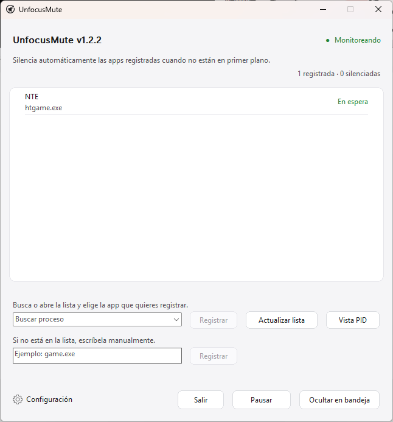

<div align="center">
  

  <h1>UnfocusMute</h1>

  <p><strong>App de bandeja para Windows, ligera y portátil, que silencia apps seleccionadas en segundo plano.<br>Solo restaura el audio que ella misma cambió.</strong></p>

  <p>
    <a href="../README.md">한국어</a> · <a href="../README_en.md">English</a> · <a href="README.ja.md">日本語</a> · <a href="README.zh-CN.md">简体中文</a> · Español · <a href="README.fr.md">Français</a> · <a href="README.pt.md">Português</a> · <a href="README.hi.md">हिन्दी</a> · <a href="README.ar.md">العربية</a>
  </p>

  <p>
    <a href="https://github.com/ilsd7/UnfocusMute/actions/workflows/ci.yml"></a>
    
    
    
    
    
    
  </p>

  <p>
    <a href="https://github.com/ilsd7/UnfocusMute/releases/latest/download/UnfocusMute-windows-x64.zip">Descargar</a>
    · <a href="#uso">Uso</a>
    · <a href="#seguridad-y-privacidad">Privacidad</a>
    · <a href="../LICENSE">Apache-2.0</a>
  </p>
</div>

---

UnfocusMute es una app pequeña y ligera para la bandeja de Windows que silencia automáticamente solo el sonido del juego o la app seleccionada cuando pasa a segundo plano. No sirve solo para juegos: también puedes registrar navegadores, apps de chat, launchers, reproductores multimedia y otras apps que aparezcan como sesiones de audio de Windows.

Al estar compilada como app nativa en Rust, se ejecuta sin un runtime adicional. El ejecutable actual para Windows ocupa unos 491 KB, menos de 1 MB.

<p align="center">
  
</p>

UnfocusMute silencia la sesión de audio de una app registrada solo mientras esa app no está en primer plano. Cuando vuelve al primer plano, restaura únicamente las sesiones que UnfocusMute silenció por su cuenta, sin tocar los silencios que hayas aplicado manualmente.

Es especialmente útil cuando dejas un juego abierto y alternas con Alt+Tab entre el navegador, una app de chat o una ventana de trabajo. Puedes apagar solo el audio de fondo sin abrir una y otra vez el mezclador de volumen de Windows.

---

## Descargar y ejecutar

En Windows 10/11, descarga el paquete ZIP y extráelo para ejecutar la app.

| Paquete más reciente |
| --- |
| [UnfocusMute-windows-x64.zip](https://github.com/ilsd7/UnfocusMute/releases/latest/download/UnfocusMute-windows-x64.zip) |
| [Archivo SHA-256](https://github.com/ilsd7/UnfocusMute/releases/latest/download/UnfocusMute-windows-x64.zip.sha256) · [Notas de la versión](https://github.com/ilsd7/UnfocusMute/releases/latest) |

Mueve la carpeta extraída `UnfocusMute-windows-x64` a la ubicación donde quieras guardar la app y ejecuta `UnfocusMute-<version>.exe` dentro de esa carpeta. Es una app portátil: no hay instalador y no necesitas runtime adicional, Rust, Visual Studio Build Tools ni MinGW.

## Uso

1. Abre UnfocusMute.
2. Elige un idioma en la pantalla de primer inicio. English viene seleccionado de forma predeterminada.
3. Inicia el juego o la app que quieres silenciar cuando esté en segundo plano.
4. Abre la lista `Buscar proceso` o escribe una búsqueda, selecciona un elemento y pulsa `Añadir selección`.
5. Si necesitas registrar solo un PID concreto, pulsa `Ver PID` y elige el elemento individual. Los objetivos por PID solo se aplican a la instancia que está en ejecución; si la app se reinicia con otro PID, selecciónala de nuevo.
6. Haz clic derecho en una app registrada para editar su nota o `Excluir del silencio automático` esa app.
7. Al cerrar la ventana, la app permanece en la bandeja y sigue vigilando. Usa `Salir` para cerrarla por completo.

## Usar notas en apps registradas

Si el nombre del proceso no basta para recordar qué app es, haz clic derecho en la app registrada y elige `Editar nota`. La nota aparece junto al nombre del proceso en la lista de apps registradas y no afecta a la detección del objetivo.

Es útil cuando un mismo launcher abre varios procesos, o cuando el nombre del ejecutable no deja claro para qué sirve.

- `htgame.exe - NTE`
- `chrome.exe (PID 18432) - perfil para reproducir música`
- `game.exe (PID 21976) - cliente del servidor de pruebas`
- `launcher.exe - launcher antes del juego real`

Las notas se guardan localmente junto con el resto de la configuración en `%APPDATA%\UnfocusMute\config.json`.

## Encontrar el nombre del ejecutable del juego

Si no sabes qué nombre registrar, busca el ejecutable terminado en `.exe` en el Administrador de tareas.

1. Inicia primero el juego.
2. Usa `Alt`+`Tab` o `Windows`+`Tab` para salir de la pantalla del juego y volver a Windows.
3. Pulsa `Ctrl`+`Shift`+`Esc` para abrir el Administrador de tareas.
4. Ordena la lista de procesos por `CPU` y busca el juego que acabas de iniciar.
5. Haz clic derecho en el juego y abre `Propiedades`.
6. Busca el nombre del ejecutable terminado en `.exe`, como `game.exe`, y añádelo a UnfocusMute.

## Antes de usar

UnfocusMute funciona con los nombres de proceso, la información de la ventana en primer plano y las sesiones CoreAudio que proporciona Windows. Si una app aún no ha creado una sesión de audio, o si un controlador, permiso o programa de seguridad limita el acceso a la sesión, la lista o el control de silencio pueden estar limitados.

Los objetivos por PID también usan el nombre `.exe` de la ventana en primer plano como respaldo, porque Windows no siempre informa el mismo PID para la ventana activa y la sesión de audio. Si hay varias instancias del mismo `.exe`, un objetivo por PID no puede separarlas perfectamente: el sonido puede restaurarse cuando otra instancia del mismo `.exe` está en primer plano.

UnfocusMute no inyecta código en juegos, no lee memoria del juego, no intercepta entradas y no modifica archivos del juego. Solo usa la información de procesos/ventana en primer plano de Windows y los controles de silencio de sesiones CoreAudio, por lo que debería funcionar sin problemas con la mayoría de sistemas anti-cheat, aunque no se puede garantizar compatibilidad con todos.

## Seguridad y privacidad

UnfocusMute funciona con un enfoque local. Solo guarda en un archivo de configuración local los nombres de procesos registrados, los PID opcionales, el idioma de la interfaz, la posición de la ventana y las opciones de inicio.

La detección de sesiones de audio y el control de silencio se procesan dentro de tu PC mediante las API CoreAudio de Windows. No hay solicitudes de red, cuentas, telemetría, analíticas, informes de fallos ni registro remoto, y UnfocusMute no crea archivos de log propios.

---

## Cómo funciona

UnfocusMute compara los objetivos registrados con la ventana que está actualmente en primer plano y silencia la sesión de audio de un objetivo solo cuando esa app está en segundo plano.

- Si la app objetivo está en primer plano, no cambia su estado de audio.
- Si la app objetivo está en segundo plano, silencia solo la sesión de audio de esa app.
- Cuando la app objetivo vuelve al primer plano, restaura solo las sesiones que UnfocusMute silenció.
- Los cambios de silencio hechos manualmente en el mezclador de volumen o con otra herramienta se respetan.

## Útil cuando

- Sueles usar Alt+Tab para salir de un juego o app mientras sigue abierta.
- Un juego o app no ofrece su propia opción de silenciarse en segundo plano.
- Quieres silenciar solo el juego en segundo plano mientras sigues oyendo el navegador o una llamada.
- Un mismo `.exe` abre varios procesos y necesitas alternar entre gestionar toda la app y controlar un PID concreto.

## Funciones

- Silencia automáticamente las apps registradas mientras están en segundo plano y restaura el audio al volver al primer plano.
- Añade objetivos desde la lista de apps en ejecución o escribiendo un nombre como `game.exe`.
- Admite objetivos por `.exe`, objetivos por PID de la instancia actual y `Ver PID`.
- Notas por app, `Excluir del silencio automático` e `Incluir en el silencio automático` por app.
- Permanencia en bandeja, pausa global, acceso a la carpeta de configuración y protección contra instancias duplicadas.
- Permite elegir idioma en el primer inicio y cambiar después dentro de la app entre English/한국어/日本語/简体中文/Español/Français/Português/हिन्दी/العربية.
- La configuración se guarda localmente en `%APPDATA%\UnfocusMute\config.json`.

---

## Compilar desde el código fuente

El objetivo de release recomendado es `x86_64-pc-windows-msvc`.

Requisitos:

- Rust stable
- Visual Studio Build Tools 2022 o Visual Studio 2022
- Windows 10/11 SDK

```powershell
rustup target add x86_64-pc-windows-msvc
cargo build --release --target x86_64-pc-windows-msvc --locked
```

La compilación de release está configurada para reducir el tamaño del binario. El release profile de `Cargo.toml` elimina símbolos, activa LTO, usa una sola codegen unit, establece `panic = "abort"` y optimiza por tamaño.

Ejecutable:

```text
target\x86_64-pc-windows-msvc\release\unfocusmute.exe
```

ZIP de distribución:

```powershell
powershell -NoProfile -ExecutionPolicy Bypass -File scripts\package-windows.ps1
```

Actualizar avisos de licencias de terceros:

```powershell
cargo about generate about.hbs -c about.toml --locked --offline -o THIRD_PARTY_NOTICES.md
```

El resultado se crea en `dist\UnfocusMute-windows-x64.zip`, junto con el archivo de verificación SHA-256 `dist\UnfocusMute-windows-x64.zip.sha256`. El ZIP incluye el ejecutable con versión (`UnfocusMute-<version>.exe`), `LICENSE`, `THIRD_PARTY_NOTICES.md`, los `README_ko.txt` y `README_en.txt` de la raíz, y los demás README `.txt` localizados bajo `docs`.

---

## Licencia

Apache License 2.0. Consulta [LICENSE](../LICENSE) para más detalles.

Consulta [THIRD_PARTY_NOTICES.md](../THIRD_PARTY_NOTICES.md) para los avisos de licencias de crates Rust de terceros.
