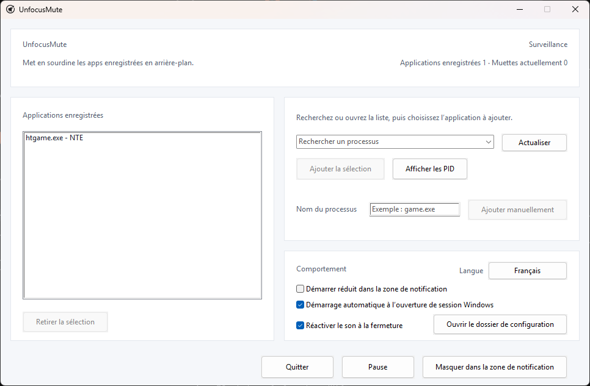

<div align="center">
  

  <h1>UnfocusMute</h1>

  <p><strong>Application Windows légère et portable, dans la zone de notification, pour mettre en sourdine des apps choisies en arrière-plan.<br>Elle réactive uniquement l’audio qu’elle a modifié.</strong></p>

  <p>
    <a href="https://github.com/ilsd7/UnfocusMute/releases/latest/download/UnfocusMute-windows-x64.zip">Télécharger</a>
    · <a href="#utilisation">Utilisation</a>
    · <a href="#sécurité-et-confidentialité">Confidentialité</a>
    · <a href="../LICENSE">Apache-2.0</a>
  </p>

  <p>
    <a href="https://github.com/ilsd7/UnfocusMute/actions/workflows/ci.yml"></a>
    
    
    
    
    
    
  </p>

  <p>
    <a href="../README.md">한국어</a> · <a href="../README_en.md">English</a> · <a href="README.ja.md">日本語</a> · <a href="README.zh-CN.md">简体中文</a> · <a href="README.es.md">Español</a> · Français · <a href="README.pt.md">Português</a> · <a href="README.hi.md">हिन्दी</a> · <a href="README.ar.md">العربية</a>
  </p>
</div>

---

UnfocusMute est une petite application légère pour la zone de notification de Windows. Elle met automatiquement en sourdine uniquement le jeu ou l’application choisi lorsqu’il passe en arrière-plan. Elle ne se limite pas aux jeux : navigateurs, messageries, lanceurs, lecteurs multimédias et autres applications peuvent aussi être enregistrés s’ils apparaissent comme sessions audio Windows.

Compilée comme application native Rust, elle s’exécute sans runtime séparé. L’exécutable Windows actuel fait environ 489 Ko, soit moins de 1 Mo.

<p align="center">
  
</p>

UnfocusMute met en sourdine la session audio d’une application enregistrée uniquement tant que cette application n’est pas au premier plan. Quand elle revient au premier plan, UnfocusMute ne réactive que les sessions qu’il avait lui-même mises en sourdine, sans toucher aux choix faits manuellement.

C’est particulièrement pratique lorsqu’un jeu reste ouvert pendant que vous passez avec Alt+Tab vers un navigateur, une messagerie ou une fenêtre de travail. Vous pouvez couper seulement l’audio de l’application en arrière-plan sans rouvrir sans cesse le mélangeur de volume Windows.

---

## Télécharger et lancer

Sous Windows 10/11, téléchargez le paquet ZIP puis extrayez-le pour lancer l’application.

| Paquet le plus récent |
| --- |
| [UnfocusMute-windows-x64.zip](https://github.com/ilsd7/UnfocusMute/releases/latest/download/UnfocusMute-windows-x64.zip) |
| [Fichier SHA-256](https://github.com/ilsd7/UnfocusMute/releases/latest/download/UnfocusMute-windows-x64.zip.sha256) · [Notes de version](https://github.com/ilsd7/UnfocusMute/releases/latest) |

Déplacez le dossier extrait `UnfocusMute-windows-x64` à l’emplacement où vous souhaitez conserver l’application, puis lancez `UnfocusMute-<version>.exe` depuis ce dossier. L’application est portable : il n’y a pas d’installateur et aucun runtime séparé, Rust, Visual Studio Build Tools ou MinGW n’est nécessaire.

## Utilisation

1. Lancez UnfocusMute.
2. Choisissez la langue au premier démarrage. English est sélectionné par défaut.
3. Lancez le jeu ou l’application à mettre en sourdine lorsqu’il passe en arrière-plan.
4. Ouvrez la liste `Rechercher un processus` ou saisissez un terme de recherche, choisissez un élément, puis cliquez sur `Ajouter la sélection`.
5. Si vous devez enregistrer seulement un PID précis, cliquez sur `Afficher les PID` et choisissez l’entrée concernée. Une cible par PID ne vaut que pour l’instance actuellement ouverte ; si l’application redémarre avec un autre PID, sélectionnez-la à nouveau.
6. Faites un clic droit sur une application enregistrée pour modifier sa note ou l’`Exclure de la sourdine auto`.
7. Fermer la fenêtre laisse l’application dans la zone de notification, où elle continue de surveiller les cibles. Cliquez sur `Quitter` pour l’arrêter complètement.

## Utiliser les notes des applications enregistrées

Si le nom du processus ne suffit pas à reconnaître l’application, faites un clic droit sur l’application enregistrée et choisissez `Modifier la note`. La note s’affiche à côté du nom du processus dans la liste, sans influencer la détection de la cible.

C’est utile lorsqu’un même lanceur de jeu ouvre plusieurs processus, ou lorsqu’un nom d’exécutable n’indique pas clairement son rôle.

- `htgame.exe - NTE`
- `chrome.exe (PID 18432) - profil pour la musique`
- `game.exe (PID 21976) - client du serveur de test`
- `launcher.exe - lanceur avant le vrai jeu`

Les notes sont enregistrées localement avec les autres réglages dans `%APPDATA%\UnfocusMute\config.json`.

## Trouver le nom de l’exécutable d’un jeu

Si vous ne savez pas quel nom enregistrer, vérifiez dans le Gestionnaire des tâches le nom de l’exécutable qui se termine par `.exe`.

1. Lancez d’abord le jeu.
2. Utilisez `Alt`+`Tab` ou `Windows`+`Tab` pour quitter l’écran du jeu et revenir à Windows.
3. Appuyez sur `Ctrl`+`Shift`+`Esc` pour ouvrir le Gestionnaire des tâches.
4. Triez la liste des processus par `CPU` afin de retrouver le jeu lancé.
5. Faites un clic droit sur le jeu et ouvrez `Propriétés`.
6. Relevez le nom de l’exécutable se terminant par `.exe`, par exemple `game.exe`, puis ajoutez-le à UnfocusMute.

## À savoir avant utilisation

UnfocusMute s’appuie sur les noms de processus, les informations de fenêtre au premier plan et les sessions CoreAudio fournies par Windows. Si une application n’a pas encore créé de session audio, ou si un pilote, un réglage de permission ou un logiciel de sécurité limite l’accès aux sessions, l’affichage dans la liste ou le contrôle de sourdine peut être limité.

Les cibles par PID utilisent aussi le nom `.exe` de la fenêtre au premier plan comme solution de repli, car Windows ne signale pas toujours le même PID pour la fenêtre active et la session audio. Si plusieurs instances du même `.exe` sont ouvertes, une cible par PID ne peut pas les séparer parfaitement : le son peut être rétabli lorsqu’une autre instance du même `.exe` est au premier plan.

UnfocusMute n’injecte pas de code dans les jeux, ne lit pas la mémoire du jeu, n’intercepte pas les entrées et ne modifie pas les fichiers du jeu. Il utilise seulement les informations de processus/fenêtre au premier plan de Windows et les commandes de sourdine des sessions CoreAudio. Il devrait donc être acceptable pour la plupart des systèmes anti-triche, mais la compatibilité avec tous les systèmes anti-triche ne peut pas être garantie.

## Sécurité et confidentialité

UnfocusMute fonctionne d’abord en local. Il stocke uniquement les noms de processus enregistrés, les PID facultatifs, la langue de l’interface, la position de la fenêtre et les options de démarrage dans un fichier de configuration local.

La détection des sessions audio et le contrôle de la sourdine sont traités sur votre PC via les API Windows CoreAudio. Il n’y a pas de requêtes réseau, compte, télémétrie, outil d’analyse, rapport de crash ni journalisation distante, et UnfocusMute ne crée pas de fichier journal séparé.

---

## Fonctionnement

UnfocusMute compare les cibles enregistrées avec la fenêtre actuellement au premier plan, puis met en sourdine la session audio de la cible uniquement lorsque l’application est en arrière-plan.

- Si l’application cible est au premier plan, son état audio n’est pas modifié.
- Si l’application cible est en arrière-plan, seule sa session audio est mise en sourdine.
- Quand l’application cible revient au premier plan, UnfocusMute restaure uniquement les sessions qu’il avait mises en sourdine.
- Les changements faits manuellement dans le mélangeur de volume ou avec un autre outil sont conservés.

## Utile quand

- Vous laissez un jeu ou une application ouvert et passez souvent à une autre fenêtre avec Alt+Tab.
- Un jeu ou une application ne propose pas sa propre option de sourdine en arrière-plan.
- Vous voulez couper seulement le son d’un jeu en arrière-plan tout en gardant audible un navigateur ou une application d’appel.
- Le même `.exe` lance plusieurs processus et vous devez passer d’une gestion par application entière à un PID précis.

## Fonctionnalités

- Met automatiquement en sourdine les applications enregistrées lorsqu’elles sont en arrière-plan et réactive l’audio à leur retour au premier plan.
- Ajoute des cibles depuis la liste des applications en cours ou par saisie directe d’un nom comme `game.exe`.
- Prend en charge les cibles par `.exe`, les cibles par PID de l’instance en cours et `Afficher les PID`.
- Notes par application, `Exclure de la sourdine auto` et `Inclure dans la sourdine auto` par application.
- Présence dans la zone de notification, pause globale, accès au dossier de configuration et protection contre les instances multiples.
- Choix de la langue au premier démarrage, puis changement immédiat dans l’application entre English/한국어/日本語/简体中文/Español/Français/Português/हिन्दी/العربية.
- Les réglages sont stockés localement dans `%APPDATA%\UnfocusMute\config.json`.

---

## Compiler depuis le code source

La cible de release recommandée est `x86_64-pc-windows-msvc`.

Prérequis :

- Rust stable
- Visual Studio Build Tools 2022 ou Visual Studio 2022
- SDK Windows 10/11

```powershell
rustup target add x86_64-pc-windows-msvc
cargo build --release --target x86_64-pc-windows-msvc --locked
```

Les builds de release sont configurés pour réduire la taille du binaire. Le release profile de `Cargo.toml` retire les symboles, active LTO, utilise une seule codegen unit, définit `panic = "abort"` et optimise pour la taille.

Exécutable :

```text
target\x86_64-pc-windows-msvc\release\unfocusmute.exe
```

ZIP de distribution :

```powershell
powershell -NoProfile -ExecutionPolicy Bypass -File scripts\package-windows.ps1
```

Actualiser les avis de licences tierces :

```powershell
cargo about generate about.hbs -c about.toml --locked --offline -o THIRD_PARTY_NOTICES.md
```

Le résultat est créé dans `dist\UnfocusMute-windows-x64.zip`, avec le fichier de vérification SHA-256 `dist\UnfocusMute-windows-x64.zip.sha256` au même emplacement. Le ZIP contient l’exécutable avec version (`UnfocusMute-<version>.exe`), `LICENSE`, `THIRD_PARTY_NOTICES.md`, les `README_ko.txt` et `README_en.txt` à la racine, ainsi que les autres README `.txt` localisés dans `docs`.

---

## Licence

Apache License 2.0. Consultez [LICENSE](../LICENSE) pour les détails.

Consultez [THIRD_PARTY_NOTICES.md](../THIRD_PARTY_NOTICES.md) pour les avis de licences des crates Rust tierces.
