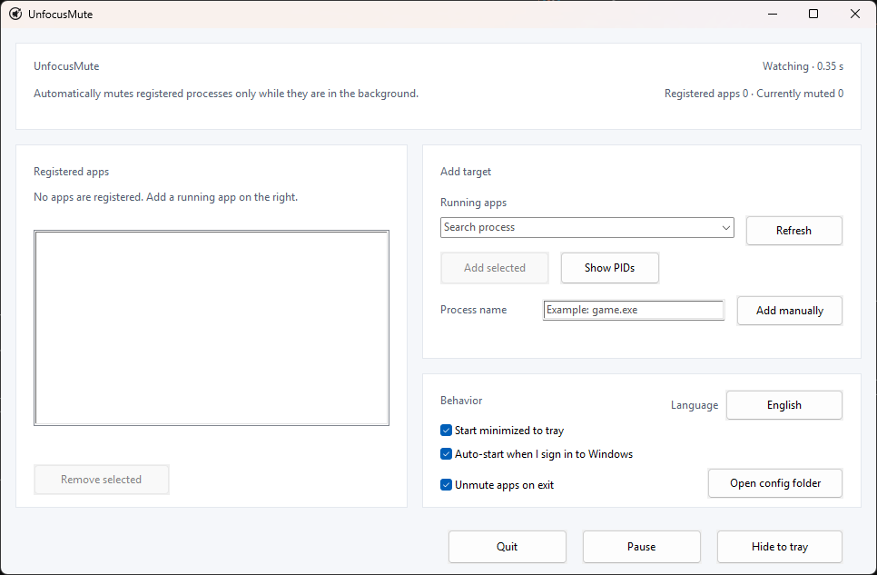

# UnfocusMute

[한국어](../README.md) | [English](../README_en.md) | [日本語](README.ja.md) | [简体中文](README.zh-CN.md) | [Español](README.es.md) | Français | [Português](README.pt.md) | [हिन्दी](README.hi.md) | [العربية](README.ar.md)

<p align="center">
  
</p>

UnfocusMute est une petite application légère pour la zone de notification Windows qui coupe uniquement le son des jeux ou applications sélectionnés lorsqu’ils passent en arrière-plan.

Compilée comme application native Rust, elle s’exécute sans runtime séparé. L’exécutable Windows actuel pèse environ 517 Ko, soit moins de 1 Mo.

Enregistrez les applications à gérer, et UnfocusMute ne coupe leurs sessions audio que lorsqu’elles ne sont plus au premier plan. Quand une application revient au premier plan, l’application ne réactive que les sessions qu’elle avait elle-même coupées, sans toucher aux coupures manuelles.

Elle est particulièrement utile lorsque vous quittez un jeu avec Alt+Tab pour passer à un navigateur, une messagerie ou une fenêtre de travail. Vous pouvez maîtriser le son en arrière-plan sans rouvrir sans cesse le mélangeur de volume Windows.

## Atouts

- Automatise la mise en sourdine en arrière-plan par jeu ou application, afin que le son suive les changements de fenêtre sans réglage manuel.
- Réactive uniquement l’audio modifié par UnfocusMute, sans modifier les coupures manuelles.
- Reste un outil léger, portable et local, sans installation, compte ni connexion réseau.

## Pratique Pour

- Passer d’un jeu ou d’une application à une autre fenêtre avec Alt+Tab.
- Les jeux qui ne proposent pas leur propre option de sourdine en arrière-plan.
- Couper le son d’un jeu en arrière-plan tout en gardant un navigateur ou une app d’appel audible.
- Passer d’une gestion par `.exe` à un contrôle PID précis lorsqu’une application ouvre plusieurs processus.

## Fonctionnalités

- Coupe automatiquement les sessions audio des applications enregistrées lorsqu’elles sont en arrière-plan et les réactive au retour au premier plan.
- Permet d’ajouter des cibles depuis la liste des applications en cours ou en saisissant un exécutable comme `game.exe`.
- Prend en charge les cibles par `.exe`, les cibles par PID de l’instance en cours et `Afficher les PID`.
- Reste dans la zone de notification, avec pause, accès au dossier de configuration et protection contre les doubles lancements.
- Permet de choisir la langue au premier lancement, puis de passer dans l’application entre English, 한국어, 日本語, 简体中文, Español, Français, Português, हिन्दी et العربية.
- Configuration locale dans `%APPDATA%\UnfocusMute\config.json`.

## Compatibilité Anticheat

UnfocusMute n’injecte pas de code dans les jeux, ne lit pas leur mémoire, n’intercepte pas les entrées et ne modifie pas leurs fichiers. Comme il utilise uniquement les informations de processus/fenêtre au premier plan de Windows et les contrôles de sourdine des sessions CoreAudio, il devrait fonctionner sans problème avec la plupart des systèmes anticheat, mais la compatibilité avec tous ne peut pas être garantie.

## Pourquoi Rust

UnfocusMute est un petit outil qui reste actif en arrière-plan. La rapidité de lancement, la faible consommation mémoire et la simplicité de distribution comptent donc beaucoup. L’exécutable natif Rust ne nécessite pas de runtime séparé et communique directement avec les API Windows CoreAudio sans embarquer de framework résident inutile.

## Sécurité et Confidentialité

UnfocusMute fonctionne d’abord en local. Il stocke uniquement les noms de processus enregistrés, les PID facultatifs, la langue de l’interface, la position de la fenêtre et les préférences de démarrage dans un fichier de configuration local.

La détection des sessions audio et le contrôle du son sont traités sur votre PC avec les API Windows CoreAudio. Il n’y a aucune requête réseau, aucun compte, aucune télémétrie, aucune analyse, aucun rapport de plantage ni aucun journal distant, et l’application ne crée pas de fichier journal séparé.

## Télécharger et Lancer

Téléchargez le ZIP pour Windows 10/11, extrayez-le, puis lancez `UnfocusMute.exe`. L’application est portable : aucun installateur n’est nécessaire, et vous n’avez pas besoin d’un runtime séparé, de Rust, de Visual Studio Build Tools ni de MinGW.

## Utilisation

1. Lancez UnfocusMute.
2. Sélectionnez une langue au premier lancement. English est sélectionné par défaut.
3. Ouvrez le jeu ou l’application à gérer.
4. Actualisez la liste des applications en cours, sélectionnez un élément, puis cliquez sur `Ajouter la sélection`.
5. Les entrées avec le même `.exe` sont regroupées par défaut.
6. Utilisez `Afficher les PID` uniquement si vous devez enregistrer une instance précise. Une cible PID ne s’applique qu’à l’instance en cours ; si l’application redémarre avec un autre PID, sélectionnez-la à nouveau.
7. Fermer la fenêtre laisse UnfocusMute actif dans la zone de notification. Utilisez `Quitter` pour l’arrêter complètement.

## Réglages Par Défaut

Au premier lancement, vous pouvez choisir si UnfocusMute démarre automatiquement à l’ouverture de session Windows. Les nouvelles configurations désactivent le démarrage automatique par défaut, activent le démarrage réduit dans la zone de notification et réactivent le son des applications à la fermeture.

Cliquez sur `Langue` dans l’application pour passer immédiatement entre English, 한국어, 日本語, 简体中文, Español, Français, Português, हिन्दी et العربية. Le choix est enregistré automatiquement.

## Build Développeur

La cible de publication recommandée est `x86_64-pc-windows-msvc`.

```powershell
rustup target add x86_64-pc-windows-msvc
cargo build --release --target x86_64-pc-windows-msvc
```

Les builds de publication sont configurées pour réduire la taille de sortie. Le release profile de `Cargo.toml` supprime les symboles, active LTO, utilise une seule codegen unit, définit `panic = "abort"` et optimise pour la taille.

Créer un ZIP de distribution :

```powershell
powershell -ExecutionPolicy Bypass -File scripts\package-windows.ps1
```

Le paquet est créé dans `dist\UnfocusMute-<version>-windows-x64.zip` et contient l’exécutable, `LICENSE`, `THIRD_PARTY_NOTICES.md`, `README_ko.md` et `README_en.md` à la racine, ainsi que les autres documents localisés dans `docs`.

## Licence

Apache License 2.0. Consultez [LICENSE](../LICENSE).

Consultez [THIRD_PARTY_NOTICES.md](../THIRD_PARTY_NOTICES.md) pour les avis de licence des crates Rust tiers.
