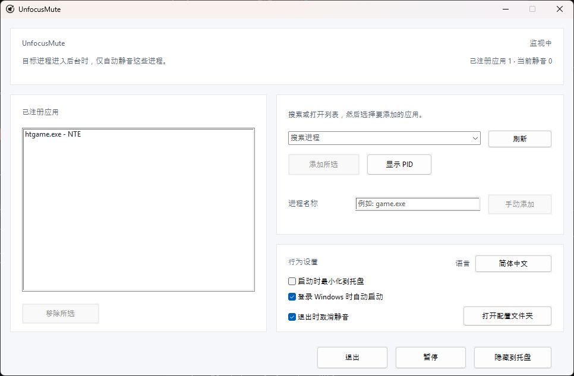

<div align="center">
  

  <h1>UnfocusMute</h1>

  <p><strong>轻量、便携的 Windows 托盘应用，用于静音选定的后台应用。<br>只恢复它自己改过的音频状态。</strong></p>

  <p>
    <a href="https://github.com/ilsd7/UnfocusMute/releases/latest/download/UnfocusMute-windows-x64.zip">下载</a>
    · <a href="#使用方法">使用方法</a>
    · <a href="#安全与隐私">隐私</a>
    · <a href="../LICENSE">Apache-2.0</a>
  </p>

  <p>
    <a href="https://github.com/ilsd7/UnfocusMute/actions/workflows/ci.yml"></a>
    
    
    
    
    
    
  </p>

  <p>
    <a href="../README.md">한국어</a> · <a href="../README_en.md">English</a> · <a href="README.ja.md">日本語</a> · 简体中文 · <a href="README.es.md">Español</a> · <a href="README.fr.md">Français</a> · <a href="README.pt.md">Português</a> · <a href="README.hi.md">हिन्दी</a> · <a href="README.ar.md">العربية</a>
  </p>
</div>

---

UnfocusMute 是一个小巧轻量的 Windows 托盘应用。当你选定的游戏或应用切到后台时，它会自动只静音该应用的声音。它不仅适用于游戏，浏览器、聊天工具、启动器、媒体播放器等只要显示为 Windows 音频会话，也可以注册使用。

它是 Rust 原生应用，无需额外运行时即可直接运行。当前 Windows 可执行文件约 491KB，小于 1MB。

<p align="center">
  
</p>

UnfocusMute 只会在注册应用不在前台时静音对应的音频会话。当该应用回到前台时，它只恢复 UnfocusMute 自己静音过的会话，不会改动你手动设置的静音状态。

当你开着游戏并用 Alt+Tab 在浏览器、聊天窗口或工作窗口之间切换时，它尤其有用。不用反复打开 Windows 音量混合器，也能只关掉后台应用的声音。

---

## 下载与运行

在 Windows 10/11 上，下载 ZIP 包并解压后即可运行。

| 最新发布包 |
| --- |
| [UnfocusMute-windows-x64.zip](https://github.com/ilsd7/UnfocusMute/releases/latest/download/UnfocusMute-windows-x64.zip) |
| [SHA-256 校验文件](https://github.com/ilsd7/UnfocusMute/releases/latest/download/UnfocusMute-windows-x64.zip.sha256) · [发行说明](https://github.com/ilsd7/UnfocusMute/releases/latest) |

把解压后的 `UnfocusMute-windows-x64` 文件夹移动到你想保存的位置，再运行其中的 `UnfocusMute-<version>.exe`。它是便携应用，没有安装步骤，也不需要额外运行时、Rust、Visual Studio Build Tools 或 MinGW。

## 使用方法

1. 启动 UnfocusMute。
2. 在首次运行的语言选择窗口中选择语言。默认选择为 English。
3. 启动你想在后台时静音的游戏或应用。
4. 打开 `搜索进程` 列表或输入搜索词，选择项目后点击 `添加所选`。
5. 如果只需要注册某个 PID，请点击 `显示 PID` 并选择单独项目。按 PID 注册的目标只适用于当前运行的实例；如果应用重启后 PID 变化，请重新选择。
6. 右键点击已注册应用，可以编辑该应用的备注，或将该应用 `从自动静音中排除`。
7. 关闭窗口后，应用会留在托盘中继续监视。如需完全退出，请点击 `退出`。

## 使用已注册应用备注

如果只看进程名很难分辨用途，请右键点击已注册应用并选择 `编辑备注`。备注会显示在注册列表中的进程名旁边，不影响目标匹配规则。

当同一个游戏启动器会打开多个进程，或某个执行文件名本身不容易看出用途时，这会很有帮助。

- `htgame.exe - NTE`
- `chrome.exe (PID 18432) - 音乐播放用配置`
- `game.exe (PID 21976) - 测试服务器客户端`
- `launcher.exe - 真正启动游戏前的启动器`

备注会和其他设置一起保存在本地的 `%APPDATA%\UnfocusMute\config.json`。

## 查看游戏执行文件名

如果不确定要注册哪个名称，请在任务管理器中查看以 `.exe` 结尾的执行文件名。

1. 先启动游戏。
2. 使用 `Alt`+`Tab` 或 `Windows`+`Tab` 离开游戏画面并返回 Windows。
3. 按 `Ctrl`+`Shift`+`Esc` 打开任务管理器。
4. 将进程列表按 `CPU` 排序，找到刚启动的游戏。
5. 右键点击游戏项目并打开 `属性`。
6. 找到类似 `game.exe` 这样以 `.exe` 结尾的执行文件名，并添加到 UnfocusMute。

## 使用前须知

UnfocusMute 依赖 Windows 提供的进程名、前台窗口信息和 CoreAudio 会话工作。如果应用尚未创建音频会话，或驱动、权限、安防软件限制了会话访问，列表显示或静音控制可能会受限。

PID 注册会把前台窗口的 `.exe` 名称也作为回退依据，因为 Windows 不一定总是为前台窗口和音频会话报告同一个 PID。若同时运行多个相同 `.exe` 实例，PID 目标无法做到完全隔离：当同一 `.exe` 的其他实例在前台时，声音也可能被恢复。

UnfocusMute 不会向游戏注入代码，不会读取游戏内存，不会 hook 输入，也不会修改游戏文件。它只使用 Windows 的进程/前台窗口信息和 CoreAudio 会话静音功能，因此预计在大多数反作弊系统中不会有问题，但无法保证兼容所有反作弊系统。

## 安全与隐私

UnfocusMute 以本地优先方式工作。它只在本地配置文件中保存已注册的进程名、可选 PID、界面语言、窗口位置和启动选项。

音频会话检测和静音控制都通过 Windows CoreAudio API 在当前电脑内完成。它不包含网络请求、账号、遥测、分析工具、崩溃报告或远程日志，也不会创建单独的应用日志文件。

---

## 工作方式

UnfocusMute 会比较已注册目标和当前前台窗口，仅当目标应用位于后台时，才静音该应用的音频会话。

- 如果目标应用在前台，UnfocusMute 不会改变其声音状态。
- 如果目标应用在后台，UnfocusMute 只静音该应用的音频会话。
- 当目标应用回到前台时，UnfocusMute 只恢复自己静音过的会话。
- 你在音量混合器或其他工具中手动改变的静音状态会保持不变。

## 适合这些场景

- 游戏或应用保持运行时，你经常用 Alt+Tab 切换到其他窗口
- 游戏或应用本身没有后台自动静音选项
- 想暂时关掉后台游戏声音，同时保留浏览器或通话应用的声音
- 同一个 `.exe` 会启动多个进程，需要在应用级管理和指定 PID 控制之间切换

## 功能

- 注册应用位于后台时自动静音其音频会话，回到前台时恢复
- 可从正在运行的应用列表中选择添加，也可手动输入 `game.exe` 这样的名称
- 支持按 `.exe` 注册、当前运行实例的单个 PID 注册，以及 `显示 PID`
- 可为每个注册应用添加备注，并单独 `从自动静音中排除` 或 `加入自动静音`
- 托盘常驻、全局暂停、打开配置文件夹、防止重复启动
- 首次运行时选择语言，之后可在应用内立即切换 English/한국어/日本語/简体中文/Español/Français/Português/हिन्दी/العربية
- 设置保存在本地 `%APPDATA%\UnfocusMute\config.json`

---

## 自行构建

推荐的发布目标是 `x86_64-pc-windows-msvc`。

要求：

- Rust stable
- Visual Studio Build Tools 2022 或 Visual Studio 2022
- Windows 10/11 SDK

```powershell
rustup target add x86_64-pc-windows-msvc
cargo build --release --target x86_64-pc-windows-msvc --locked
```

发布构建已针对较小体积进行配置。`Cargo.toml` 的 release profile 会剥离符号、启用 LTO、使用单个 codegen unit、设置 `panic = "abort"`，并优先优化体积。

可执行文件：

```text
target\x86_64-pc-windows-msvc\release\unfocusmute.exe
```

发布 ZIP：

```powershell
powershell -NoProfile -ExecutionPolicy Bypass -File scripts\package-windows.ps1
```

刷新第三方许可证声明：

```powershell
cargo about generate about.hbs -c about.toml --locked --offline -o THIRD_PARTY_NOTICES.md
```

结果会生成到 `dist\UnfocusMute-windows-x64.zip`，同一位置还会生成用于 SHA-256 校验的 `dist\UnfocusMute-windows-x64.zip.sha256`。ZIP 包含带版本号的可执行文件（`UnfocusMute-<version>.exe`）、`LICENSE`、`THIRD_PARTY_NOTICES.md`、根目录的 `README_ko.txt` 和 `README_en.txt`，以及 `docs` 文件夹中的其他语言 README `.txt` 文件。

---

## 许可证

Apache License 2.0。详情请查看 [LICENSE](../LICENSE)。

第三方 Rust crate 许可证声明请查看 [THIRD_PARTY_NOTICES.md](../THIRD_PARTY_NOTICES.md)。
