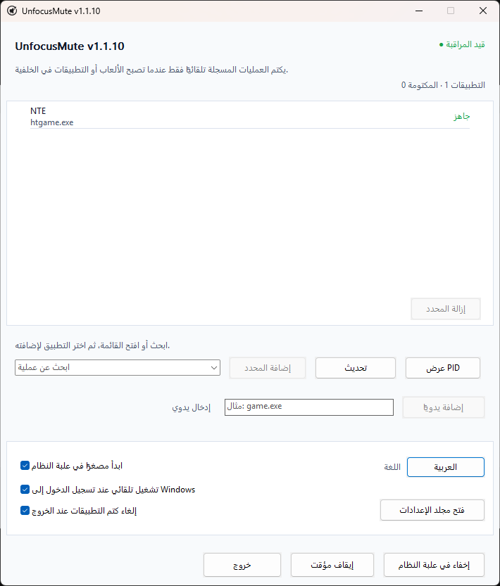

<div align="center" dir="rtl">
  

  <h1>UnfocusMute</h1>

  <p><strong>تطبيق خفيف لعلبة نظام Windows يكتم تلقائيًا الألعاب والتطبيقات المختارة عندما تنتقل إلى الخلفية.</strong></p>

  <p>
    <a href="../README.md">English</a> · <a href="README_ko.md">한국어</a> · <a href="README_ja.md">日本語</a> · <a href="README_zh-CN.md">简体中文</a> · <a href="README_es.md">Español</a> · <a href="README_fr.md">Français</a> · <a href="README_pt.md">Português</a> · <a href="README_hi.md">हिन्दी</a> · العربية
  </p>

  <p>
    <a href="https://github.com/ilsd7/UnfocusMute/actions/workflows/ci.yml"></a>
    &nbsp;
    
    &nbsp;
    <a href="../LICENSE"></a>
  </p>

  <p>محلي بالكامل &nbsp;·&nbsp; بلا وصول إلى الشبكة &nbsp;·&nbsp; بلا قياس عن بُعد &nbsp;·&nbsp; بلا تثبيت</p>

  <p>
    <a href="https://github.com/ilsd7/UnfocusMute/releases/latest/download/UnfocusMute-windows-x64.zip">تنزيل</a>
    · <a href="#الاستخدام">الاستخدام</a>
    · <a href="#الأمان-والخصوصية">الخصوصية</a>
    · <a href="../LICENSE">Apache-2.0</a>
  </p>
</div>

---

<div dir="rtl">

UnfocusMute تطبيق صغير وخفيف لعلبة نظام Windows يكتم تلقائيًا الألعاب والتطبيقات المختارة عندما تنتقل إلى الخلفية.

لا يقتصر على الألعاب؛ يمكنك أيضًا تسجيل تطبيقات عادية مثل المتصفحات، وتطبيقات المراسلة، والمشغلات، ومشغلات الوسائط.

<p align="center">
  
</p>

لأنه مبني كتطبيق Rust أصلي، يعمل مباشرة دون بيئة تشغيل منفصلة. يبلغ حجم الملف التنفيذي نحو 500 كيلوبايت.

يطبّق UnfocusMute الكتم والاستعادة فقط على الجلسات التي غيّرها بنفسه. أما الجلسات التي كنت قد كتمتها مسبقًا فلا يغيّرها.

---

## مناسب عندما

- تترك لعبة أو تطبيقًا مفتوحًا وتتنقل كثيرًا إلى نافذة أخرى عبر Alt+Tab.
- لا يوفّر التطبيق أو اللعبة خيارًا داخليًا للكتم عند الانتقال إلى الخلفية.
- تريد كتم صوت اللعبة في الخلفية فقط مع إبقاء المتصفح أو تطبيق المكالمة مسموعًا.
- يفتح نفس `.exe` عدة عمليات وتحتاج إلى التبديل بين إدارة التطبيق كله والتحكم في PID محدد.

## الميزات

- يكتم تلقائيًا جلسة الصوت للتطبيقات المسجلة عندما تكون في الخلفية ويعيد الصوت عند عودتها إلى المقدمة.
- يسجل التطبيقات من قائمة التطبيقات قيد التشغيل أو عبر كتابة اسم مثل `game.exe`.
- يدعم التسجيل عبر `.exe`، والتسجيل عبر PID للنسخة الحالية، وخيار `عرض PID`.
- ملاحظات لكل تطبيق، وحالة كتم مباشرة، وعناصر تحكم `إيقاف مؤقت` / `استئناف` لكل تطبيق.
- التشغيل المقيم في علبة النظام، ملخص حالة في علبة النظام، إيقاف مؤقت عام، فتح مجلد الإعدادات، ومنع تشغيل نسخ متعددة.
- يجمع زر الإعدادات في الزاوية السفلية اليسرى خيارات السلوك واللغة ومجلد الإعدادات ومستودع GitHub ومعلومات الإصدار.
- اختيار اللغة عند التشغيل الأول، ثم التبديل داخل التطبيق بين English/한국어/日本語/简体中文/Español/Français/Português/हिन्दी/العربية.
- تُحفظ الإعدادات محليًا في `%APPDATA%\UnfocusMute\config.json`.

---

## التنزيل والتشغيل

على Windows 10/11، حمّل حزمة ZIP وفك ضغطها لتشغيل التطبيق مباشرة.

| أحدث حزمة |
| --- |
| [UnfocusMute-windows-x64.zip](https://github.com/ilsd7/UnfocusMute/releases/latest/download/UnfocusMute-windows-x64.zip) |
| [ملف تحقق SHA-256](https://github.com/ilsd7/UnfocusMute/releases/latest/download/UnfocusMute-windows-x64.zip.sha256) · [ملاحظات الإصدار](https://github.com/ilsd7/UnfocusMute/releases/latest) |

بعد فك الضغط، انقل مجلد `UnfocusMute-windows-x64` إلى المكان الذي تريد حفظ التطبيق فيه، ثم شغّل `UnfocusMute-v<version>.exe` من داخله.

UnfocusMute تطبيق مستقل لا يحتاج إلى تثبيت. ولا تحتاج أيضًا إلى تثبيت Rust أو Visual Studio Build Tools أو MinGW أو أي أدوات تطوير أخرى.

> **ملاحظة:** بسبب تكلفة شهادات توقيع الكود، يُوزع التطبيق حاليًا من دون توقيع كود Windows. قد يظهر تحذير Windows SmartScreen أو تحذير "ناشر غير معروف" عند التشغيل الأول. إذا أردت التحقق من سلامة الملف بنفسك، فراجع قسم التحقق من ملفات الإصدار أدناه.

## ملاحظات قبل الاستخدام

يعتمد UnfocusMute على أسماء العمليات ومعلومات النافذة الموجودة في المقدمة وجلسات CoreAudio التي يوفرها Windows. إذا لم ينشئ التطبيق جلسة صوت بعد، أو إذا حدّ برنامج تشغيل أو إعداد صلاحيات أو برنامج أمان من الوصول إلى الجلسة، فقد تكون القائمة أو التحكم في الكتم محدودين جزئيًا.

**سلوك التسجيل باستخدام PID:** لا يقدّم Windows دائمًا القيمة نفسها لـ PID جلسة الصوت وPID النافذة الموجودة في المقدمة. للتعويض عن ذلك، يعتبر UnfocusMute أن التطبيق عاد إلى المقدمة عندما يطابق اسم `.exe` الخاص بـ PID المسجل اسم `.exe` للنافذة الحالية في المقدمة.

لذلك، إذا كانت عدة نسخ من نفس `.exe` تعمل في الوقت نفسه، فقد لا يمكن فصل PID محدد بدقة كاملة. في هذه الحالة قد يعود الصوت عندما تكون نسخة أخرى في المقدمة.

**التوافق مع أنظمة مكافحة الغش:** لا يحقن UnfocusMute أي كود داخل الألعاب، ولا يقرأ ذاكرة اللعبة، ولا يعترض الإدخال، ولا يغيّر ملفات اللعبة. يستخدم فقط معلومات العملية/النافذة في Windows ووظائف كتم جلسات CoreAudio، لذلك يُتوقع أن يعمل دون مشكلة مع معظم أنظمة مكافحة الغش، لكن لا يمكن ضمان التوافق مع كل نظام منها.

## الاستخدام

1. شغّل UnfocusMute.
2. اختر اللغة من نافذة الاختيار التي تظهر عند التشغيل الأول. اللغة الافتراضية هي الإنجليزية.
3. شغّل اللعبة أو التطبيق الذي تريد كتمه عندما يصبح في الخلفية.
4. افتح قائمة `ابحث عن عملية` أو اكتب كلمة بحث، ثم اختر عنصرًا واضغط `تسجيل`.
5. إذا احتجت إلى تسجيل PID محدد فقط، اضغط `عرض PID` واختر العنصر المنفصل. التسجيل عبر PID ينطبق فقط على النسخة الحالية قيد التشغيل؛ إذا أُعيد تشغيل التطبيق وتغيّر PID، فاختره من جديد.
6. انقر بزر الفأرة الأيمن على تطبيق مسجل لتعديل ملاحظته أو استخدام `إيقاف مؤقت`.
7. افتح `الإعدادات` من الزاوية السفلية اليسرى لتغيير خيارات السلوك.
8. عند إغلاق النافذة، يبقى التطبيق في علبة النظام ويواصل مراقبة التطبيقات المسجلة. استخدم `خروج` لإنهائه بالكامل.

## استخدام ملاحظات التطبيقات المسجلة

إذا كان اسم العملية وحده لا يكفي لتذكّر التطبيق، فانقر بزر الفأرة الأيمن على التطبيق المسجل واختر `تعديل الملاحظة`. تظهر الملاحظة فوق اسم العملية في قائمة التطبيقات المسجلة، ولا تؤثر في طريقة مطابقة التطبيق.

هذا مفيد عندما يفتح مشغل لعبة واحد عدة عمليات، أو عندما لا يوضح اسم الملف التنفيذي وظيفته.

- `htgame.exe - NTE`
- `game.exe (PID 21976) - عميل خادم الاختبار`

تُحفظ الملاحظات محليًا مع بقية الإعدادات في `%APPDATA%\UnfocusMute\config.json`.

## معرفة اسم الملف التنفيذي

إذا لم تكن متأكدًا من الاسم الذي يجب تسجيله، فتحقق من اسم الملف التنفيذي الذي ينتهي بـ `.exe` في مدير المهام.

1. شغّل أولًا التطبيق الذي تريد تسجيله.
2. استخدم `Alt`+`Tab` أو `Windows`+`Tab` لمغادرة شاشة اللعبة والعودة إلى Windows.
3. اضغط `Ctrl`+`Shift`+`Esc` لفتح مدير المهام.
4. رتّب قائمة العمليات حسب `CPU` للعثور على التطبيق الذي شغّلته للتو.
5. انقر بزر الفأرة الأيمن على ذلك العنصر وافتح `خصائص`.
6. ابحث عن اسم الملف التنفيذي المنتهي بـ `.exe`، مثل `game.exe`، ثم أضفه إلى UnfocusMute.

---

## الأمان والخصوصية

UnfocusMute تطبيق يعمل محليًا بالكامل. يعمل بشكل طبيعي حتى من دون اتصال بالإنترنت، ولا يرسل طلبات شبكة تلقائية، ولا يستخدم القياس عن بُعد، ولا يرسل تقارير أعطال، ولا يجري تسجيلًا عن بُعد، ولا يجمع البيانات. ولا يحتاج إلى صلاحيات مسؤول.

الاستثناء الوحيد هو أنك عندما تضغط بنفسك زر `مستودع GitHub` في شاشة الإعدادات، يُفتح مستودع GitHub الخاص بهذا المشروع في المتصفح الافتراضي.

**ما يحفظه:** أسماء العمليات المسجلة، ومعرّفات PID التي تسجلها مباشرة، وآخر حالة كتم للتطبيقات المسجلة، والملاحظات التي تكتبها، واللغة والإعدادات المختارة، وموضع النافذة.

تُحفظ هذه القيم في `%APPDATA%\UnfocusMute\config.json` ولا تُرسل إلى أي مكان خارجي.

لكن إذا فعّلت التشغيل التلقائي عند تسجيل الدخول إلى Windows، فسيُحفظ مسار الملف التنفيذي الحالي أيضًا في قيمة `UnfocusMute` ضمن `HKEY_CURRENT_USER\Software\Microsoft\Windows\CurrentVersion\Run`.

لإزالة كل الملفات المتعلقة بالتطبيق، احذف مجلد التطبيق ثم احذف `%APPDATA%\UnfocusMute`.
إذا سبق أن فعّلت التشغيل التلقائي، فاحذف أيضًا قيمة السجل المذكورة أعلاه.

**ما لا يحفظه:** سجل الاستخدام، أو سجلات النشاط، أو بيانات الصوت، أو عناوين النوافذ، أو ضغطات المفاتيح، أو أي معلومات أخرى غير مذكورة أعلاه ضمن «ما يحفظه».

اكتشاف جلسات الصوت والتحكم في الكتم يستخدمان واجهات Windows CoreAudio فقط، ولا يحقن UnfocusMute كودًا داخل عمليات الألعاب ولا يقرأ ذاكرتها.

---

## التحقق من ملفات الإصدار

لا تفترض أن الملفات المرفوعة إلى GitHub Releases تطابق دائمًا الكود المصدري المنشور في المستودع.

إذا أسيء استخدام صلاحيات الإصدار أو تم اختراق حساب، فقد تُرفع ملفات مبنية من كود مختلف أو ملفات معدلة إلى الإصدار.

من أجل الشفافية، يوفر UnfocusMute طريقة تتيح للمستخدمين التحقق من أن الملفات المرفوعة إلى GitHub Releases هي مخرجات بناء رسمية أنشأها GitHub Actions من كود هذا المستودع عند الوسم المطابق.

يتم إنشاء ملف ZIP الخاص بالإصدار وملف checksum بصيغة SHA-256 تلقائيًا عبر GitHub Actions، ويأتي كل ملف مع إثبات مصدر البناء (attestation).

تتيح لك الأوامر أدناه التحقق من أن ملف ZIP الذي حمّلته أُنشئ بواسطة البناء الرسمي لهذا المستودع.

```powershell
gh attestation verify .\UnfocusMute-windows-x64.zip -R ilsd7/UnfocusMute
gh attestation verify .\UnfocusMute-windows-x64.zip.sha256 -R ilsd7/UnfocusMute
```

---

## البناء من المصدر

هدف الإصدار الموصى به هو `x86_64-pc-windows-msvc`.

المتطلبات:

- Rust stable
- Visual Studio Build Tools 2022 أو Visual Studio 2022
- Windows 10/11 SDK

```powershell
rustup target add x86_64-pc-windows-msvc
cargo build --release --target x86_64-pc-windows-msvc --locked
```

إعدادات بناء الإصدار مضبوطة لتقليل حجم الملف الناتج. يزيل ملف تعريف الإصدار في `Cargo.toml` الرموز، ويفعّل LTO، ويستخدم وحدة codegen واحدة، ويضبط `panic = "abort"`، ويحسّن الحجم.

الملف التنفيذي:

```text
target\x86_64-pc-windows-msvc\release\unfocusmute.exe
```

ملف ZIP للتوزيع:

```powershell
powershell -NoProfile -ExecutionPolicy Bypass -File scripts\package-windows.ps1
```

تحديث إشعارات تراخيص الطرف الثالث:

```powershell
cargo about generate about.hbs -c about.toml --locked --offline -o THIRD_PARTY_NOTICES.md
```

يتم إنشاء الناتج في `dist\UnfocusMute-windows-x64.zip`، ومعه ملف تحقق SHA-256 في `dist\UnfocusMute-windows-x64.zip.sha256`. يحتوي ZIP على الملف التنفيذي الذي يتضمن رقم الإصدار (`UnfocusMute-v<version>.exe`)، و`LICENSE`، و`THIRD_PARTY_NOTICES.md`، وملفات README بصيغة `.txt` لكل لغة داخل مجلد `docs`.

---

## الترخيص

Apache License 2.0. راجع [LICENSE](../LICENSE) للتفاصيل.

راجع [THIRD_PARTY_NOTICES.md](../THIRD_PARTY_NOTICES.md) لإشعارات تراخيص crates الخاصة بـ Rust من أطراف ثالثة.

</div>
