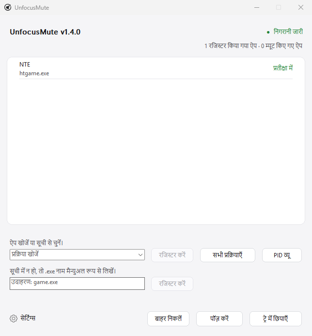

<div align="center">
  

  <h1>UnfocusMute</h1>

  <p><strong>चुने हुए गेम और ऐप्स का फ़ोकस हटने पर उन्हें म्यूट करने वाला हल्का, पोर्टेबल और पूरी तरह local Windows tray app।<br>यह सिर्फ उसी audio को restore करता है जिसे इसने mute किया था — कोई network नहीं, कोई logs नहीं।</strong></p>

  <p>
    <a href="../README.md">한국어</a> · <a href="README_en.md">English</a> · <a href="README_ja.md">日本語</a> · <a href="README_zh-CN.md">简体中文</a> · <a href="README_es.md">Español</a> · <a href="README_fr.md">Français</a> · <a href="README_pt.md">Português</a> · हिन्दी · <a href="README_ar.md">العربية</a>
  </p>

  <p>
    <a href="https://github.com/ilsd7/UnfocusMute/actions/workflows/ci.yml"></a>
    
    <a href="../LICENSE"></a>
  </p>

  <p>पूरी तरह local operation &nbsp;·&nbsp; कोई network connection नहीं &nbsp;·&nbsp; कोई log file नहीं &nbsp;·&nbsp; administrator rights की जरूरत नहीं</p>

  <p>
    <a href="https://github.com/ilsd7/UnfocusMute/releases/latest/download/UnfocusMute-windows-x64.zip">डाउनलोड</a>
    · <a href="#उपयोग">उपयोग</a>
    · <a href="#सुरक्षा-और-प्राइवेसी">प्राइवेसी</a>
    · <a href="../LICENSE">Apache-2.0</a>
  </p>
</div>

---

UnfocusMute Windows tray के लिए एक छोटा और हल्का app है। चुना हुआ game या app background में जाते ही यह सिर्फ उसी app की आवाज अपने आप mute करता है। यह सिर्फ games तक सीमित नहीं है: browsers, messengers, launchers, media players और दूसरे apps भी register किए जा सकते हैं, अगर वे Windows audio session के रूप में दिखते हों।

Rust native app के रूप में build होने के कारण यह अलग runtime के बिना सीधे चलता है। मौजूदा executable लगभग 489 KB है, यानी 1 MB से कम।

<p align="center">
  
</p>

Mute और restore, दोनों सिर्फ उन sessions पर लागू होते हैं जिन्हें UnfocusMute ने खुद बदला था। जिन्हें आपने पहले से mute कर रखा था, उन्हें यह नहीं बदलता।

---

## कब उपयोगी है

- Game या app खुला रखते हुए आप अक्सर Alt+Tab से दूसरी window में जाते हों।
- Game या app में background में जाने पर mute करने का अपना option न हो।
- Browser या call app की आवाज रखते हुए सिर्फ background game audio बंद करना हो।
- एक ही `.exe` कई processes खोलता हो और कभी पूरे app को, कभी किसी खास PID को control करना हो।

## मुख्य सुविधाएं

- Registered apps background में होने पर audio session अपने आप mute करता है और foreground में लौटने पर restore करता है।
- Running app list से target जोड़ें या `game.exe` जैसा नाम manually लिखें।
- `.exe` targets, current-instance PID targets और `PID विवरण दिखाएं` support करता है।
- App-wise notes, app-wise `ऑटो-म्यूट से बाहर करें` और `ऑटो-म्यूट में शामिल करें`।
- Tray में चलना, global pause, config folder खोलना और duplicate instance protection।
- पहली बार language चुनें, फिर app के अंदर English/한국어/日本語/简体中文/Español/Français/Português/हिन्दी/العربية तुरंत बदलें।
- Settings local रूप से `%APPDATA%\UnfocusMute\config.json` में save होती हैं।

---

## डाउनलोड और चलाएं

Windows 10/11 पर ZIP package डाउनलोड करके extract करें, फिर app चला सकते हैं।

| नवीनतम पैकेज |
| --- |
| [UnfocusMute-windows-x64.zip](https://github.com/ilsd7/UnfocusMute/releases/latest/download/UnfocusMute-windows-x64.zip) |
| [SHA-256 file](https://github.com/ilsd7/UnfocusMute/releases/latest/download/UnfocusMute-windows-x64.zip.sha256) · [रिलीज़ नोट्स](https://github.com/ilsd7/UnfocusMute/releases/latest) |

निकले हुए `UnfocusMute-windows-x64` folder को अपनी पसंद की जगह पर ले जाएं, फिर उसी folder में `UnfocusMute-<version>.exe` चलाएं। यह portable app है, इसलिए installer की जरूरत नहीं है और Rust, Visual Studio Build Tools, MinGW या दूसरे development tools भी जरूरी नहीं हैं।

> **ध्यान दें:** code-signing certificate की cost के कारण app अभी Windows code signing के बिना distribute किया जाता है। पहली बार चलाते समय Windows SmartScreen या "unknown publisher" warning दिख सकती है। File integrity खुद verify करनी हो, तो नीचे release file verification section देखें।

## इस्तेमाल से पहले ध्यान दें

UnfocusMute Windows से मिलने वाले process names, foreground window information और CoreAudio sessions के आधार पर काम करता है। अगर किसी app ने अभी audio session नहीं बनाया है, या driver, permission setting या security tool session access को सीमित करता है, तो list दिखना या mute control कुछ हद तक सीमित हो सकता है।

PID register करते समय एक behavior ध्यान में रखें। Windows audio session PID और foreground window PID के लिए हमेशा एक ही value नहीं देता। इसे संभालने के लिए UnfocusMute registered PID के `.exe` name और अभी foreground में मौजूद window के `.exe` name के match होने पर उस app को foreground में लौटा हुआ मानता है। इसलिए एक ही `.exe` के कई instances चल रहे हों, तो किसी खास PID को हमेशा पूरी तरह अलग नहीं किया जा सकता, और दूसरे instance के foreground में होने पर भी आवाज restore हो सकती है।

UnfocusMute games में code inject नहीं करता, game memory नहीं पढ़ता, input hook नहीं करता और game files modify नहीं करता। यह सिर्फ Windows process/foreground window information और CoreAudio session mute controls इस्तेमाल करता है, इसलिए ज्यादातर anti-cheat systems में समस्या नहीं होनी चाहिए, लेकिन हर anti-cheat के साथ compatibility की guarantee नहीं दी जा सकती।

## उपयोग

1. UnfocusMute चलाएं।
2. पहली बार खुलने वाली भाषा स्क्रीन में भाषा चुनें। Default चयन English है।
3. वह game या app शुरू करें जिसे background में जाने पर mute करना है।
4. `प्रक्रिया खोजें` list खोलें या search term लिखें, item चुनें और `चयनित जोड़ें` दबाएं।
5. अगर सिर्फ किसी खास PID को register करना है, तो `PID विवरण दिखाएं` दबाकर अलग entry चुनें। PID target सिर्फ अभी चल रहे instance पर लागू होता है; app restart होकर PID बदल जाए तो उसे फिर से चुनें।
6. पंजीकृत ऐप पर right-click करके उसका नोट संपादित किया जा सकता है या उस ऐप को `ऑटो-म्यूट से बाहर करें` किया जा सकता है।
7. विंडो बंद करने पर ऐप tray में रहकर निगरानी जारी रखता है। पूरी तरह बंद करने के लिए `बंद करें` दबाएं।

## पंजीकृत ऐप्स में नोट इस्तेमाल करें

अगर प्रक्रिया नाम देखकर ऐप पहचानना मुश्किल हो, तो पंजीकृत ऐप पर right-click करें और `नोट संपादित करें` चुनें। नोट पंजीकृत ऐप सूची में प्रक्रिया नाम के साथ दिखाई देता है और लक्ष्य पहचान को प्रभावित नहीं करता।

यह तब काम आता है जब एक ही game launcher कई प्रक्रियाएं खोलता हो, या executable name देखकर उसका उपयोग साफ न समझ आए।

- `htgame.exe - NTE`
- `chrome.exe (PID 18432) - music playback profile`
- `game.exe (PID 21976) - test server client`
- `launcher.exe - असली game शुरू होने से पहले वाला launcher`

नोट बाकी settings के साथ local रूप से `%APPDATA%\UnfocusMute\config.json` में save होते हैं।

## गेम का executable नाम कैसे देखें

अगर register करने वाला नाम साफ न हो, तो Task Manager में `.exe` पर खत्म होने वाला executable name देखें।

1. पहले game शुरू करें।
2. `Alt`+`Tab` या `Windows`+`Tab` से game screen छोड़कर Windows पर लौटें।
3. Task Manager खोलने के लिए `Ctrl`+`Shift`+`Esc` दबाएं।
4. Process list को `CPU` के अनुसार sort करके अभी शुरू किया हुआ game ढूंढें।
5. Game item पर right-click करें और `Properties` खोलें।
6. `game.exe` जैसा `.exe` पर खत्म होने वाला executable name देखें और उसे UnfocusMute में add करें।

---

## सुरक्षा और प्राइवेसी

UnfocusMute पूरी तरह local app है। सब कुछ आपके इसी PC के अंदर होता है, और internet connection न होने पर भी यह सामान्य रूप से काम करता है।

**यह क्या save करता है** — Registered process names, optional PIDs, UI language, window position और startup options। यह data सिर्फ `%APPDATA%\UnfocusMute\config.json` में save होता है और बाहर कहीं नहीं भेजा जाता।

**यह क्या save नहीं करता** — App log files नहीं बनाता। Sessions के बीच behavior history कहीं भी नहीं रखी जाती।

**यह क्या नहीं करता** — Network requests, telemetry, crash reporting या remote logging नहीं है। Administrator rights की भी जरूरत नहीं होती।

Audio session detection और mute control सिर्फ Windows CoreAudio APIs इस्तेमाल करते हैं, और UnfocusMute game processes में code inject नहीं करता या उनकी memory नहीं पढ़ता।

---

## Release files verify करें

Security के लिए users ऐसी स्थिति से बचाव कर सकें जहाँ कोई developer repository में published code से अलग files maliciously distribute करे, या account compromise जैसी घटना के कारण release files tamper हो जाएँ। इसके लिए ऐसा procedure चाहिए जिससे users सीधे verify कर सकें कि GitHub Releases पर upload की गई files public source code से match करने वाली official builds हैं।

Security और transparency के लिए UnfocusMute ऐसा verification method देता है जिससे users सीधे confirm कर सकते हैं कि GitHub Releases पर upload की गई distribution files इस repository के source code से match करने वाली official builds हैं।

Release ZIP file और SHA-256 checksum file GitHub के automated build system, GitHub Actions, से बनते हैं, और दोनों files origin proof करने वाली attestations के साथ दी जाती हैं।

नीचे दिए गए commands से verify किया जा सकता है कि GitHub Releases से download किया गया ZIP file इस repository की official build के समान है।

```powershell
gh attestation verify .\UnfocusMute-windows-x64.zip -R ilsd7/UnfocusMute
gh attestation verify .\UnfocusMute-windows-x64.zip.sha256 -R ilsd7/UnfocusMute
```

---

## सोर्स से बिल्ड करें

Recommended release target `x86_64-pc-windows-msvc` है।

Requirements:

- Rust stable
- Visual Studio Build Tools 2022 या Visual Studio 2022
- Windows 10/11 SDK

```powershell
rustup target add x86_64-pc-windows-msvc
cargo build --release --target x86_64-pc-windows-msvc --locked
```

Release build छोटे output size के लिए configured है। `Cargo.toml` का release profile symbols strip करता है, LTO enable करता है, single codegen unit इस्तेमाल करता है, `panic = "abort"` set करता है और size के लिए optimize करता है।

Executable:

```text
target\x86_64-pc-windows-msvc\release\unfocusmute.exe
```

Distribution ZIP:

```powershell
powershell -NoProfile -ExecutionPolicy Bypass -File scripts\package-windows.ps1
```

Third-party license notices refresh करें:

```powershell
cargo about generate about.hbs -c about.toml --locked --offline -o THIRD_PARTY_NOTICES.md
```

परिणाम `dist\UnfocusMute-windows-x64.zip` में बनता है, और उसी जगह SHA-256 जांच फ़ाइल `dist\UnfocusMute-windows-x64.zip.sha256` भी बनती है। ZIP में version वाला executable (`UnfocusMute-<version>.exe`), `LICENSE`, `THIRD_PARTY_NOTICES.md`, और `docs` folder में भाषा के अनुसार README `.txt` files शामिल होती हैं।

---

## लाइसेंस

Apache License 2.0। जानकारी के लिए [LICENSE](../LICENSE) देखें।

तीसरे पक्ष के Rust crate license notices के लिए [THIRD_PARTY_NOTICES.md](../THIRD_PARTY_NOTICES.md) देखें।
