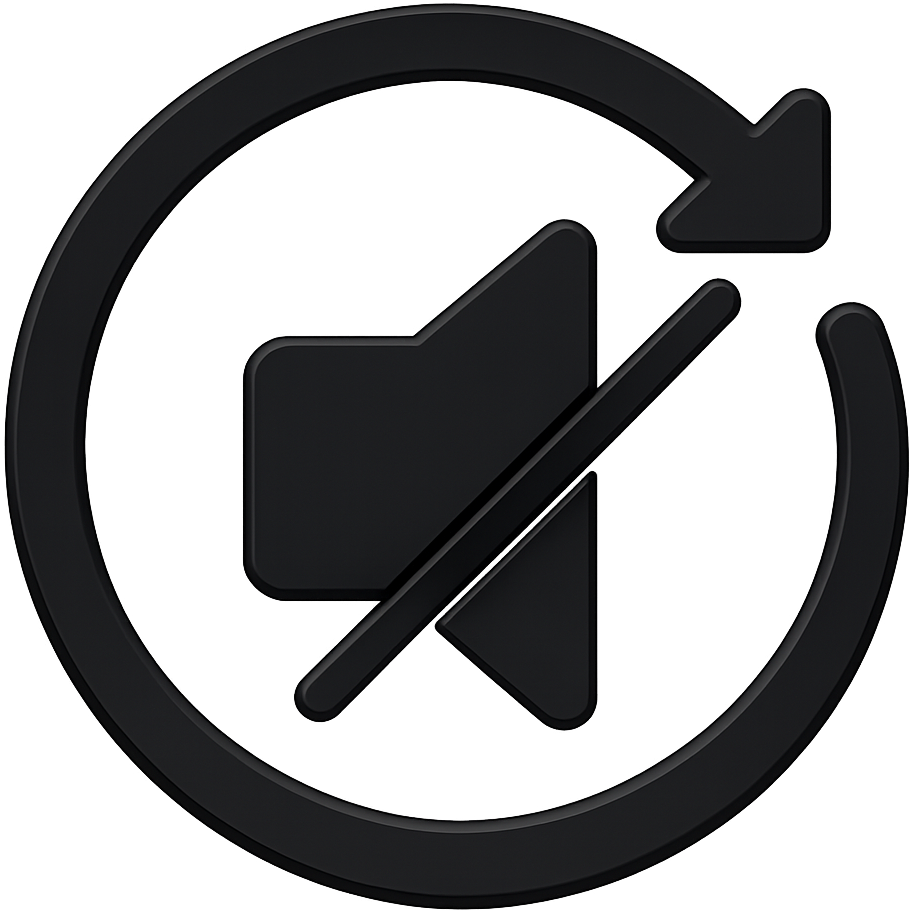
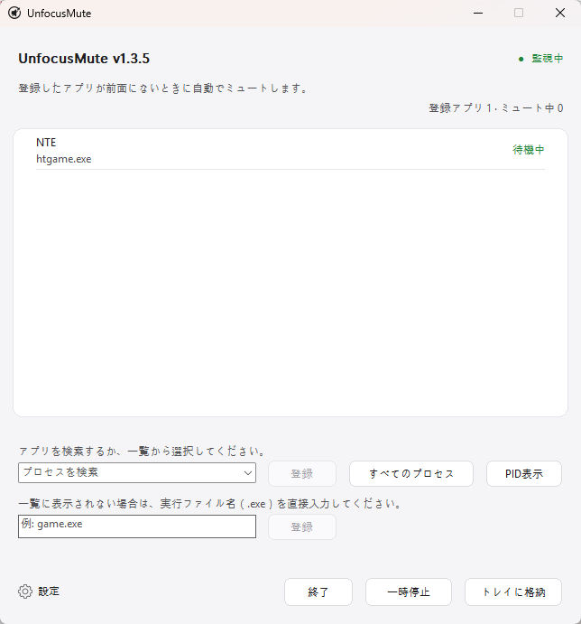

<div align="center">
  

  <h1>UnfocusMute</h1>

  <p><strong>選択したゲームやアプリがフォーカスを失うと自動でミュートする、軽量なWindowsトレイアプリです。</strong></p>

  <p>
    <a href="../README.md">English</a> · <a href="README_ko.md">한국어</a> · 日本語 · <a href="README_zh-CN.md">简体中文</a> · <a href="README_es.md">Español</a> · <a href="README_fr.md">Français</a> · <a href="README_pt.md">Português</a> · <a href="README_hi.md">हिन्दी</a> · <a href="README_ar.md">العربية</a>
  </p>

  <p>
    <a href="https://github.com/ilsd7/UnfocusMute/actions/workflows/ci.yml"></a>
    
    <a href="../LICENSE"></a>
  </p>

  <p>完全ローカル &nbsp;·&nbsp; ネットワークアクセスなし &nbsp;·&nbsp; テレメトリなし &nbsp;·&nbsp; ポータブル</p>

  <p>
    <a href="https://github.com/ilsd7/UnfocusMute/releases/latest/download/UnfocusMute-windows-x64.zip">ダウンロード</a>
    · <a href="#使い方">使い方</a>
    · <a href="#セキュリティとプライバシー">プライバシー</a>
    · <a href="../LICENSE">Apache-2.0</a>
  </p>
</div>

---

UnfocusMuteは、選択したゲームやアプリがバックグラウンドへ移ると自動でミュートする小さく軽量なWindowsトレイアプリです。

ゲームに限らず、ブラウザ、メッセンジャー、ランチャー、メディアプレイヤーなどの一般的なアプリも登録できます。

<p align="center">
  
</p>

Rust製のネイティブアプリなので、別途ランタイムなしでそのまま実行できます。実行ファイルのサイズは約500 KBです。

ミュートと復元はどちらも、UnfocusMuteが直接変更したセッションにだけ適用されます。ユーザーが元からミュートしていたセッションはそのまま維持します。

---

## こんなときに便利です

- ゲームやアプリを起動したままAlt+Tabで別のウィンドウへよく移るとき
- バックグラウンド時の自動ミュート機能がないゲームやアプリを静かにしておきたいとき
- ブラウザや通話アプリの音は聞きながら、バックグラウンドのゲーム音だけを止めたいとき
- 同じ `.exe` から複数プロセスが起動し、アプリ単位の管理と特定PIDの制御を使い分けたいとき

## 主な機能

- 登録したアプリがバックグラウンドにある間はオーディオセッションを自動でミュートし、前面に戻ると音声を復元
- 実行中のアプリ一覧から選択して登録、または `game.exe` のような名前を直接入力
- `.exe` 単位の登録、現在実行中のインスタンス向けの個別PID登録、`PID表示` に対応
- 登録アプリごとのメモ、リアルタイムのミュート状態表示、アプリごとの `一時停止` と `再開`
- トレイ常駐、トレイでの状態要約、全体一時停止、設定フォルダーを開く、二重起動防止
- 左下の設定ボタンに、動作オプション、言語、設定フォルダー、GitHubリポジトリ、バージョン情報を集約
- 初回起動時に言語を選択し、以後アプリ内でEnglish/한국어/日本語/简体中文/Español/Français/Português/हिन्दी/العربيةをすぐに切り替え
- 設定は `%APPDATA%\UnfocusMute\config.json` にローカル保存

---

## ダウンロードと実行

Windows 10/11では、配布ZIPをダウンロードして展開すればすぐに実行できます。

| 最新の配布ファイル |
| --- |
| [UnfocusMute-windows-x64.zip](https://github.com/ilsd7/UnfocusMute/releases/latest/download/UnfocusMute-windows-x64.zip) |
| [SHA-256確認ファイル](https://github.com/ilsd7/UnfocusMute/releases/latest/download/UnfocusMute-windows-x64.zip.sha256) · [リリースノート](https://github.com/ilsd7/UnfocusMute/releases/latest) |

展開した `UnfocusMute-windows-x64` フォルダーを好きな場所へ移動し、その中の `UnfocusMute-v<version>.exe` を実行します。ポータブルアプリなのでインストーラーはなく、Rust、Visual Studio Build Tools、MinGWなどの開発ツールも不要です。

> **参考:** コード署名証明書には費用がかかるため、現在はWindowsコード署名なしで配布しています。初回実行時にWindows SmartScreenや「不明な発行元」の警告が表示される場合があります。ファイルの整合性を自分で確認したい場合は、下のリリースファイル検証セクションを参照してください。

## 使用前に知っておくこと

UnfocusMuteは、Windowsが提供するプロセス名、前面ウィンドウ情報、CoreAudioセッションを基準に動作します。アプリがまだオーディオセッションを作成していない場合や、ドライバー、権限設定、セキュリティソフトがセッションへのアクセスを制限している場合は、一覧表示やミュート制御が一部制限されることがあります。

**PID登録時の動作:** WindowsはオーディオセッションのPIDと前面ウィンドウのPIDを常に同じ値で返すとは限りません。これを補正するため、UnfocusMuteは登録したPIDの `.exe` 名と現在前面にあるウィンドウの `.exe` 名が同じ場合、そのアプリが前面に戻ったものとして扱います。

そのため、同じ `.exe` を複数同時に起動している環境では、特定PIDだけを完全には区別できないことがあります。この場合、別のインスタンスが前面にあっても音声が復元される可能性があります。

**アンチチートとの互換性:** UnfocusMuteはゲームにコードを注入したり、ゲームメモリを読んだり、入力をフックしたり、ゲームファイルを変更したりしません。Windowsのプロセス/前面ウィンドウ情報とCoreAudioセッションのミュート機能だけを使うため、多くのアンチチートでは問題になりにくいと考えられますが、すべてのアンチチートとの互換性は保証できません。

## 使い方

1. UnfocusMuteを起動します。
2. 初回起動時に表示される言語選択画面で使用する言語を選びます。既定値は英語です。
3. バックグラウンド時にミュートしたいゲームやアプリを起動します。
4. `プロセスを検索` の一覧を開くか検索語を入力し、項目を選んで `登録` を押します。
5. 特定のPIDだけを登録したい場合は `PID表示` を押して個別項目を選びます。PID登録は現在実行中のインスタンスだけに適用されるため、アプリを再起動してPIDが変わった場合は選び直してください。
6. 登録済みアプリを右クリックすると、アプリごとのメモを編集したり、`一時停止` したりできます。
7. 左下の `設定` を開くと、動作オプションを変更できます。
8. ウィンドウを閉じてもアプリはトレイに残り、登録アプリの監視を続けます。完全に終了するには `終了` を押します。

## 登録アプリのメモを活用する

プロセス名だけでは何のアプリか分かりにくい場合は、登録済みアプリを右クリックして `メモを編集` を選んでください。メモは登録一覧でプロセス名の上に表示され、アプリの判定には影響しません。

同じゲームランチャーが複数のプロセスを起動する場合や、名前だけでは用途が分かりにくい実行ファイルを登録する場合に便利です。

- `htgame.exe - NTE`
- `game.exe (PID 21976) - テストサーバークライアント`

メモは他の設定と一緒に `%APPDATA%\UnfocusMute\config.json` にローカル保存されます。

## 実行ファイル名を確認する

登録する名前が分からない場合は、タスクマネージャーで `.exe` で終わる実行ファイル名を確認してください。

1. 先に登録したいアプリを起動します。
2. `Alt`+`Tab` または `Windows`+`Tab` でゲーム画面を離れ、Windowsに戻ります。
3. `Ctrl`+`Shift`+`Esc` を押してタスクマネージャーを開きます。
4. プロセス一覧を `CPU` 順に並べ、起動したばかりのアプリを探します。
5. その項目を右クリックして `プロパティ` を開きます。
6. `game.exe` のように `.exe` で終わる実行ファイル名を確認し、UnfocusMuteに登録します。

---

## セキュリティとプライバシー

UnfocusMuteは完全ローカルのアプリです。すべての動作は現在のPC内だけで行われ、インターネット接続がなくても通常どおり動作します。

例外として、設定画面のGitHubリポジトリボタンをユーザーが押した場合のみ、既定のブラウザーでこのプロジェクトのGitHubリポジトリを開きます。

**保存するもの:** 登録したプロセス名、任意のPID、入力したメモ、選択した言語、ウィンドウ位置、起動オプション、登録アプリのミュート復元状態。
このデータは `%APPDATA%\UnfocusMute\config.json` にのみ保存され、外部へ送信されません。

**保存しないもの:** アプリのログファイルは作成しません。セッションをまたいだ動作履歴も残しません。

**行わないこと:** 自動的なネットワーク要求、テレメトリ、クラッシュレポート、リモートログ送信、データ収集は行いません。管理者権限も要求しません。

オーディオセッションの検出とミュート制御にはWindows CoreAudio APIだけを使用し、ゲームプロセスにコードを注入したりメモリを読んだりしません。

---

## リリースファイルの検証

GitHub Releasesにアップロードされた配布ファイルが、リポジトリで公開されているソースコードと常に一致するとは限りません。

リリース権限が悪用されたり、アカウントが侵害されたりした場合、公開コードとは異なる内容でビルドされたファイルや改ざんされたファイルがリリースにアップロードされる可能性があります。

透明性のため、UnfocusMuteはGitHub Releasesにアップロードされたファイルが、このリポジトリの該当タグのソースコードからGitHub Actionsで生成された公式ビルド成果物であることをユーザー自身が確認できる方法を提供しています。

リリースZIPファイルとSHA-256チェックサムファイルはGitHub Actionsで自動生成され、それぞれにビルド元を確認できるビルド証明（attestation）が付与されます。

以下のコマンドを使うと、ダウンロードしたZIPファイルがこのリポジトリの公式ビルドで生成されたものか確認できます。

```powershell
gh attestation verify .\UnfocusMute-windows-x64.zip -R ilsd7/UnfocusMute
gh attestation verify .\UnfocusMute-windows-x64.zip.sha256 -R ilsd7/UnfocusMute
```

---

## 自分でビルドする

推奨リリースターゲットは `x86_64-pc-windows-msvc` です。

必要なもの:

- Rust stable
- Visual Studio Build Tools 2022 または Visual Studio 2022
- Windows 10/11 SDK

```powershell
rustup target add x86_64-pc-windows-msvc
cargo build --release --target x86_64-pc-windows-msvc --locked
```

リリースビルドはファイルサイズを小さくするように設定されています。`Cargo.toml` のリリースプロファイルでは、シンボル削除、LTO、単一codegen unit、`panic = "abort"`、サイズ優先最適化を使用しています。

実行ファイル:

```text
target\x86_64-pc-windows-msvc\release\unfocusmute.exe
```

配布ZIP:

```powershell
powershell -NoProfile -ExecutionPolicy Bypass -File scripts\package-windows.ps1
```

サードパーティライセンス表記の更新:

```powershell
cargo about generate about.hbs -c about.toml --locked --offline -o THIRD_PARTY_NOTICES.md
```

成果物は `dist\UnfocusMute-windows-x64.zip` に作成され、同じ場所にSHA-256確認用の `dist\UnfocusMute-windows-x64.zip.sha256` も作成されます。ZIPにはバージョン付きの実行ファイル（`UnfocusMute-v<version>.exe`）、`LICENSE`、`THIRD_PARTY_NOTICES.md`、`docs` フォルダー内の言語別README `.txt` 文書が含まれます。

---

## ライセンス

Apache License 2.0です。詳しくは[LICENSE](../LICENSE)を確認してください。

サードパーティRust crateのライセンス表記は[THIRD_PARTY_NOTICES.md](../THIRD_PARTY_NOTICES.md)を確認してください。
