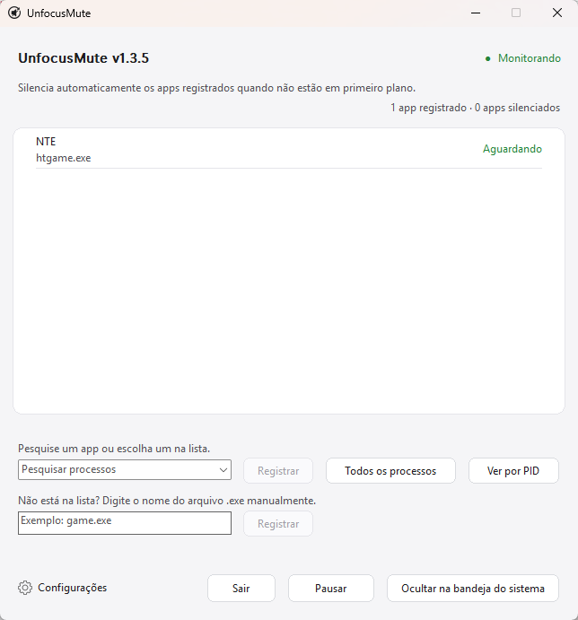

<div align="center">
  

  <h1>UnfocusMute</h1>

  <p><strong>App leve e portátil para a bandeja do Windows que silencia automaticamente jogos e apps selecionados quando vão para segundo plano.<br>Restaura apenas as sessões que o UnfocusMute silenciou diretamente e funciona totalmente de forma local, sem conexões de rede em segundo plano.</strong></p>

  <p>
    <a href="README_ko.md">한국어</a> · <a href="../README.md">English</a> · <a href="README_ja.md">日本語</a> · <a href="README_zh-CN.md">简体中文</a> · <a href="README_es.md">Español</a> · <a href="README_fr.md">Français</a> · Português · <a href="README_hi.md">हिन्दी</a> · <a href="README_ar.md">العربية</a>
  </p>

  <p>
    <a href="https://github.com/ilsd7/UnfocusMute/actions/workflows/ci.yml"></a>
    
    <a href="../LICENSE"></a>
  </p>

  <p>Funcionamento totalmente local &nbsp;·&nbsp; Sem conexões de rede em segundo plano &nbsp;·&nbsp; Sem arquivos de log &nbsp;·&nbsp; Não requer permissões de administrador</p>

  <p>
    <a href="https://github.com/ilsd7/UnfocusMute/releases/latest/download/UnfocusMute-windows-x64.zip">Baixar</a>
    · <a href="#uso">Uso</a>
    · <a href="#segurança-e-privacidade">Privacidade</a>
    · <a href="../LICENSE">Apache-2.0</a>
  </p>
</div>

---

UnfocusMute é um app pequeno e leve para a bandeja do Windows que silencia automaticamente a sessão de áudio do jogo ou app selecionado quando ele vai para segundo plano. Ele não é só para jogos: navegadores, mensageiros, launchers, players de mídia e outros apps também podem ser registrados se aparecerem como sessões de áudio do Windows.

Criado como app nativo em Rust, ele roda sem runtime separado. O executável tem cerca de 500 KB.

<p align="center">
  
</p>

O silenciamento e a restauração se aplicam apenas às sessões que o UnfocusMute alterou diretamente. Sessões que já estavam silenciadas por você não são modificadas.

---

## Útil quando

- Você costuma usar Alt+Tab para sair de um jogo ou app enquanto ele continua aberto.
- Um jogo ou app não oferece opção própria de silenciar em segundo plano.
- Você quer silenciar só o áudio do jogo em segundo plano enquanto mantém navegador ou chamada audíveis.
- O mesmo `.exe` abre vários processos e você precisa alternar entre gerenciar o app inteiro e controlar um PID específico.

## Recursos

- Silencia automaticamente apps registrados enquanto estão em segundo plano e restaura o áudio quando voltam ao primeiro plano.
- Registra apps pela lista de apps em execução ou digitando um nome como `game.exe`.
- Suporta entradas por `.exe`, entradas por PID da instância atual e `Ver PID`.
- Notas por app, estado de silenciamento em tempo real por app, `Pausar` e `Retomar` por app.
- Execução na bandeja, resumo de status na bandeja, pausa global, acesso à pasta de configuração e proteção contra instâncias duplicadas.
- O botão de configurações no canto inferior esquerdo reúne opções de comportamento, idioma, pasta de configuração, GitHub e versão.
- Escolha de idioma no primeiro uso e troca imediata dentro do app entre English/한국어/日本語/简体中文/Español/Français/Português/हिन्दी/العربية.
- Configurações salvas localmente em `%APPDATA%\UnfocusMute\config.json`.

---

## Baixar e executar

No Windows 10/11, baixe o pacote ZIP e extraia para executar o app.

| Pacote mais recente |
| --- |
| [UnfocusMute-windows-x64.zip](https://github.com/ilsd7/UnfocusMute/releases/latest/download/UnfocusMute-windows-x64.zip) |
| [Arquivo SHA-256](https://github.com/ilsd7/UnfocusMute/releases/latest/download/UnfocusMute-windows-x64.zip.sha256) · [Notas da versão](https://github.com/ilsd7/UnfocusMute/releases/latest) |

Mova a pasta extraída `UnfocusMute-windows-x64` para o local onde você quer manter o app e execute `UnfocusMute-v<version>.exe` dentro dela. O app é portátil: não há instalador e você não precisa de Rust, Visual Studio Build Tools, MinGW nem outras ferramentas de desenvolvimento.

> **Observação:** Como certificados de assinatura de código têm custo, o app atualmente é distribuído sem assinatura de código do Windows. No primeiro uso, podem aparecer avisos do Windows SmartScreen ou de "editor desconhecido". Se quiser verificar a integridade do arquivo por conta própria, consulte a seção de verificação dos arquivos de release abaixo.

## Antes de usar

UnfocusMute funciona com base nos nomes de processo, nas informações da janela em primeiro plano e nas sessões CoreAudio fornecidas pelo Windows. Se um app ainda não criou uma sessão de áudio, ou se um driver, permissão ou ferramenta de segurança limitar o acesso à sessão, a listagem ou o controle de silenciamento pode ficar parcialmente limitado.

**Comportamento ao registrar por PID:** O Windows nem sempre informa o mesmo PID para uma sessão de áudio e para a janela em primeiro plano. Para compensar isso, o UnfocusMute trata o app como tendo voltado ao primeiro plano quando o nome `.exe` do PID registrado corresponde ao nome `.exe` da janela atual em primeiro plano.

Assim, se houver várias instâncias do mesmo `.exe` em execução ao mesmo tempo, um PID específico pode não ser separado perfeitamente. Nesse caso, o som pode ser restaurado quando outra instância estiver em foco.

**Compatibilidade com anti-cheat:** UnfocusMute não injeta código em jogos, não lê memória do jogo, não intercepta entrada e não modifica arquivos do jogo. Ele usa apenas informações de processo/janela em primeiro plano do Windows e controles de silenciamento de sessões CoreAudio, então deve funcionar sem problemas na maioria dos anti-cheats, mas não é possível garantir compatibilidade com todos eles.

## Uso

1. Abra o UnfocusMute.
2. Escolha o idioma na tela de primeiro uso. O padrão é inglês.
3. Inicie o jogo ou app que você quer silenciar quando estiver em segundo plano.
4. Abra a lista `Pesquisar processo` ou digite uma busca, escolha um item e clique em `Registrar`.
5. Se precisar registrar apenas um PID específico, clique em `Ver PID` e escolha a entrada individual. Entradas por PID valem só para a instância em execução; se o app reiniciar com outro PID, selecione novamente.
6. Clique com o botão direito em um app registrado para editar sua nota ou usar `Pausar`.
7. Abra `Configurações` no canto inferior esquerdo para alterar opções de comportamento.
8. Ao fechar a janela, o app continua rodando na bandeja e monitorando. Use `Sair` para encerrar completamente.

## Usar notas em apps registrados

Se o nome do processo não for suficiente para lembrar qual app é, clique com o botão direito no app registrado e escolha `Editar nota`. A nota aparece acima do nome do processo na lista de apps registrados e não afeta a regra de detecção.

Isso ajuda quando um mesmo launcher de jogo abre vários processos ou quando o nome do executável não deixa claro para que ele serve.

- `htgame.exe - NTE`
- `game.exe (PID 21976) - cliente do servidor de teste`

As notas são salvas localmente junto com o restante das configurações em `%APPDATA%\UnfocusMute\config.json`.

## Encontrar o nome do executável

Se você não souber qual nome registrar, confira no Gerenciador de Tarefas o executável que termina em `.exe`.

1. Inicie primeiro o app que você quer registrar.
2. Use `Alt`+`Tab` ou `Windows`+`Tab` para sair da tela do jogo e voltar ao Windows.
3. Pressione `Ctrl`+`Shift`+`Esc` para abrir o Gerenciador de Tarefas.
4. Ordene a lista de processos por `CPU` e encontre o app que acabou de iniciar.
5. Clique com o botão direito nesse item e abra `Propriedades`.
6. Veja o nome do executável que termina em `.exe`, como `game.exe`, e adicione-o ao UnfocusMute.

---

## Segurança e privacidade

UnfocusMute é um app totalmente local. Tudo acontece dentro do seu PC, e ele funciona normalmente mesmo sem conexão com a internet.

Como exceção, quando você clica no botão do GitHub em Configurações, a página do GitHub deste projeto é aberta no navegador padrão.

**O que ele salva:** Nomes de processos registrados, PIDs opcionais, notas que você escrever, idioma escolhido, posição da janela, opções de inicialização e o estado de restauração dos apps silenciados pelo UnfocusMute.
Esses dados ficam apenas em `%APPDATA%\UnfocusMute\config.json` e não são enviados para fora.

**O que ele não salva:** O app não cria arquivos de log. Nenhum histórico de atividade é mantido entre sessões.

**O que ele não faz:** Não faz solicitações de rede automáticas, não usa telemetria, não envia relatórios de falha, não faz logs remotos e não coleta dados. Ele também não exige permissões de administrador.

A detecção de sessões de áudio e o controle de silenciamento usam apenas as APIs CoreAudio do Windows, e o UnfocusMute não injeta código em processos de jogos nem lê a memória deles.

---

## Verificar arquivos de release

Não presuma que os arquivos enviados ao GitHub Releases sempre correspondem ao código-fonte publicado no repositório.

Se permissões de release forem abusadas ou uma conta for comprometida, arquivos criados a partir de outro código ou arquivos modificados podem ser enviados para uma release.

Por transparência, o UnfocusMute oferece uma forma de verificar se os arquivos enviados ao GitHub Releases são artefatos oficiais gerados pelo GitHub Actions a partir do código-fonte deste repositório na tag correspondente.

O ZIP da release e o arquivo de checksum SHA-256 são gerados automaticamente pelo GitHub Actions, e cada arquivo é fornecido com uma atestação de procedência da compilação (attestation).

Os comandos abaixo permitem confirmar que o ZIP baixado foi gerado pela compilação oficial deste repositório.

```powershell
gh attestation verify .\UnfocusMute-windows-x64.zip -R ilsd7/UnfocusMute
gh attestation verify .\UnfocusMute-windows-x64.zip.sha256 -R ilsd7/UnfocusMute
```

---

## Compilar a partir do código-fonte

O alvo de release recomendado é `x86_64-pc-windows-msvc`.

Requisitos:

- Rust stable
- Visual Studio Build Tools 2022 ou Visual Studio 2022
- Windows 10/11 SDK

```powershell
rustup target add x86_64-pc-windows-msvc
cargo build --release --target x86_64-pc-windows-msvc --locked
```

As compilações de release são configuradas para reduzir o tamanho do binário. O perfil de release em `Cargo.toml` remove símbolos, ativa LTO, usa uma única codegen unit, define `panic = "abort"` e otimiza para tamanho.

Executável:

```text
target\x86_64-pc-windows-msvc\release\unfocusmute.exe
```

ZIP de distribuição:

```powershell
powershell -NoProfile -ExecutionPolicy Bypass -File scripts\package-windows.ps1
```

Atualizar avisos de licenças de terceiros:

```powershell
cargo about generate about.hbs -c about.toml --locked --offline -o THIRD_PARTY_NOTICES.md
```

O resultado é criado em `dist\UnfocusMute-windows-x64.zip`, com um arquivo de verificação SHA-256 em `dist\UnfocusMute-windows-x64.zip.sha256`. O ZIP inclui o executável com versão (`UnfocusMute-v<version>.exe`), `LICENSE`, `THIRD_PARTY_NOTICES.md` e os README `.txt` localizados por idioma em `docs`.

---

## Licença

Apache License 2.0. Veja [LICENSE](../LICENSE) para mais detalhes.

Veja [THIRD_PARTY_NOTICES.md](../THIRD_PARTY_NOTICES.md) para os avisos de licenças de crates Rust de terceiros.
