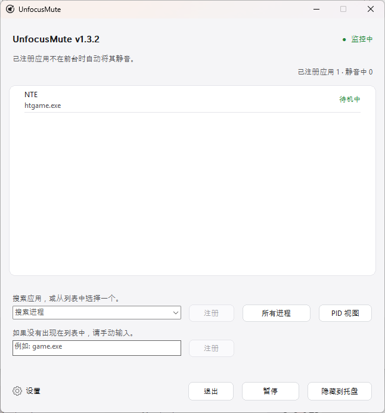

<div align="center">
  

  <h1>UnfocusMute</h1>

  <p><strong>轻量级 Windows 托盘应用，可在选定的游戏或应用失去焦点时自动将其静音。</strong></p>

  <p>
    <a href="../README.md">English</a> · <a href="README_ko.md">한국어</a> · <a href="README_ja.md">日本語</a> · 简体中文 · <a href="README_es.md">Español</a> · <a href="README_fr.md">Français</a> · <a href="README_pt.md">Português</a> · <a href="README_hi.md">हिन्दी</a> · <a href="README_ar.md">العربية</a>
  </p>

  <p>
    <a href="https://github.com/ilsd7/UnfocusMute/actions/workflows/ci.yml"></a>
    &nbsp;
    
    &nbsp;
    <a href="../LICENSE"></a>
  </p>

  <p>完全本地 &nbsp;·&nbsp; 无网络访问 &nbsp;·&nbsp; 无遥测 &nbsp;·&nbsp; 免安装</p>

  <p>
    <a href="https://github.com/ilsd7/UnfocusMute/releases/latest/download/UnfocusMute-windows-x64.zip">下载</a>
    · <a href="#使用方法">使用方法</a>
    · <a href="#安全与隐私">隐私</a>
    · <a href="../LICENSE">Apache-2.0</a>
  </p>
</div>

---

UnfocusMute 是一款小巧轻量的 Windows 托盘应用，可在选定的游戏或应用转入后台时自动将其静音。

它并不局限于游戏，也可以注册浏览器、聊天工具、启动器、媒体播放器等常规应用。

<p align="center">
  
</p>

它是 Rust 原生应用，无需额外运行时即可直接运行。可执行文件大小约为 500 KB。

静音和恢复都只会作用于 UnfocusMute 自己改动过的会话。你原本已经静音的会话会保持不变。

---

## 适合这些场景

- 游戏或应用保持运行时，你经常用 Alt+Tab 切换到其他窗口
- 游戏或应用本身没有后台自动静音选项
- 想只关掉后台游戏声音，同时保留浏览器或通话应用的声音

## 功能

- 已注册应用处于后台时自动静音其音频会话，回到前台时恢复音频
- 从默认列表中选择已有音频会话的应用；需要时可以切换到 `所有进程`，或直接输入 `game.exe` 这样的名称
- 支持按 `.exe` 注册、当前运行实例的单个 PID 注册，以及 `PID 视图`
- 可为每个注册应用添加备注，显示实时静音状态，并单独 `暂停` 或 `继续`
- 托盘常驻、托盘状态摘要、全局暂停、打开配置文件夹、防止重复运行
- 首次运行时选择语言，之后可在应用内立即切换 English/한국어/日本語/简体中文/Español/Français/Português/हिन्दी/العربية
- 设置保存在本地 `%APPDATA%\UnfocusMute\config.json`

---

## 下载与运行

在 Windows 10/11 上，下载 ZIP 包并解压后即可运行。

| 最新发布包 |
| --- |
| [UnfocusMute-windows-x64.zip](https://github.com/ilsd7/UnfocusMute/releases/latest/download/UnfocusMute-windows-x64.zip) |
| [SHA-256 校验文件](https://github.com/ilsd7/UnfocusMute/releases/latest/download/UnfocusMute-windows-x64.zip.sha256) · [发行说明](https://github.com/ilsd7/UnfocusMute/releases/latest) |

解压后，将 `UnfocusMute-windows-x64` 文件夹移动到你想保存的位置，再运行其中的 `UnfocusMute-v<version>.exe`。

UnfocusMute 是免安装的独立应用。你也无需安装 Rust、Visual Studio Build Tools、MinGW 等开发工具。

> **提示：** 由于代码签名证书需要成本，目前发布文件未进行 Windows 代码签名。首次运行时，Windows SmartScreen 或“未知发布者”警告可能会出现。如果你想自行确认文件完整性，请参阅下面的发布文件验证部分。

## 使用前须知

UnfocusMute 依赖 Windows 提供的进程名、前台窗口信息和 CoreAudio 会话工作。
因此，如果驱动、权限设置或安全软件限制了会话访问，静音控制可能会受到一定限制。

默认选择列表只显示当前已有音频会话的应用。如果应用尚未创建音频会话，可以切换到 `所有进程`，从正在运行的 `.exe` 列表中查找。点击 `仅音频会话` 可回到筛选后的列表。

**PID 注册时的行为：** Windows 并不总是为音频会话和前台窗口报告同一个 PID。为修正这种情况，UnfocusMute 会在已注册 PID 的 `.exe` 名称与当前前台窗口的 `.exe` 名称相同时，将该应用视为已回到前台。

因此，如果同时运行多个相同 `.exe` 实例，指定 PID 可能无法被完全区分。在这种情况下，当其他实例位于前台时，声音也可能被恢复。

**反作弊兼容性：** UnfocusMute 不会向游戏注入代码，不会读取游戏内存，不会 hook 输入，也不会修改游戏文件。它只使用 Windows 的进程/前台窗口信息和 CoreAudio 会话静音功能，因此预计在大多数反作弊系统中不会有问题，但无法保证兼容所有反作弊系统。

## 使用方法

1. 启动 UnfocusMute。
2. 在首次运行的语言选择窗口中选择语言。默认语言为英语。
3. 启动你想在后台时静音的游戏或应用。
4. 在 `搜索进程` 中选择应用，或输入搜索词找到应用后点击 `注册`。如果应用尚未创建音频会话，请切换到 `所有进程`，查看正在运行的所有进程列表。点击 `仅音频会话` 可回到筛选后的列表。如果列表中没有，请手动输入 `.exe` 名称。
5. 如果只需要注册某个 PID，请点击 `PID 视图` 并选择单独项目。按 PID 注册只适用于当前运行的实例；如果应用重启后 PID 变化，请重新选择。
6. 右键点击已注册应用，可以编辑该应用的备注，或使用 `暂停`。
7. 打开左下角的 `设置`，即可更改行为选项。
8. 关闭窗口后，应用会留在托盘中继续监视已注册应用。如需完全退出，请点击 `退出`。

## 使用已注册应用备注

如果只看进程名很难分辨用途，请右键点击已注册应用并选择 `编辑备注`。备注会显示在注册列表中的进程名上方，不影响应用匹配规则。

当同一个游戏启动器会打开多个进程，或某个可执行文件名本身不容易看出用途时，这会很有帮助。

- `htgame.exe - NTE`
- `game.exe (PID 21976) - 测试服务器客户端`

备注会和其他设置一起保存在本地的 `%APPDATA%\UnfocusMute\config.json`。

## 查看可执行文件名

如果不确定要注册哪个名称，请在任务管理器中查看以 `.exe` 结尾的可执行文件名。

1. 先启动要注册的应用。
2. 使用 `Alt`+`Tab` 或 `Windows`+`Tab` 离开游戏画面并返回 Windows。
3. 按 `Ctrl`+`Shift`+`Esc` 打开任务管理器。
4. 将进程列表按 `CPU` 排序，找到刚启动的应用。
5. 右键点击该项目并打开 `属性`。
6. 找到类似 `game.exe` 这样以 `.exe` 结尾的可执行文件名，并将其添加到 UnfocusMute。

---

## 安全与隐私

UnfocusMute 是完全在本地运行的应用。即使没有互联网连接也能正常工作，并且不会发起自动网络请求、使用遥测、发送崩溃报告、进行远程日志记录或收集数据。它也不需要管理员权限。

作为例外，只有当你在设置界面点击 `GitHub 仓库` 按钮时，才会在默认浏览器中打开本项目的 GitHub 仓库。

**保存的内容：** 已注册的进程名、手动注册的 PID、已注册应用最近一次的静音状态、你写入的备注、选择的语言和设置、窗口位置。

这些值会保存在 `%APPDATA%\UnfocusMute\config.json`，不会发送到任何外部位置。

不过，如果你开启 Windows 登录时自动启动，当前可执行文件路径也会保存到 `HKEY_CURRENT_USER\Software\Microsoft\Windows\CurrentVersion\Run` 下的 `UnfocusMute` 值中。

要删除与应用相关的所有文件，请删除应用文件夹，然后删除 `%APPDATA%\UnfocusMute` 文件夹。
如果曾经开启过自动启动，也请一并删除上面的注册表值。

**不会保存的内容：** 使用记录、活动日志、音频数据、窗口标题、按键输入等上面“保存的内容”中未明确列出的任何信息。

音频会话检测和静音控制只使用 Windows CoreAudio API，并且不会向游戏进程注入代码或读取其内存。

---

## 验证发布文件

不要假设上传到 GitHub Releases 的发布文件总是与仓库中公开的源代码一致。

如果发布权限被滥用，或账号遭到盗用，使用不同代码构建的文件或被篡改的文件可能会被上传到 Release。

为保持透明，UnfocusMute 提供了一种方法，让用户可以验证上传到 GitHub Releases 的文件是否确实是由 GitHub Actions 根据本仓库对应标签的源代码生成的官方构建产物。

发布 ZIP 文件和 SHA-256 校验和文件由 GitHub Actions 自动生成，并且每个文件都会附带可验证构建来源的构建证明（attestation）。

使用下面的命令可以检查下载的 ZIP 文件是否由本仓库的官方构建生成。

```powershell
gh attestation verify .\UnfocusMute-windows-x64.zip -R ilsd7/UnfocusMute
gh attestation verify .\UnfocusMute-windows-x64.zip.sha256 -R ilsd7/UnfocusMute
```

---

## 自行构建

推荐的发布目标是 `x86_64-pc-windows-msvc`。

要求：

- Rust stable
- Visual Studio Build Tools 2022 或 Visual Studio 2022
- Windows 10/11 SDK

```powershell
rustup target add x86_64-pc-windows-msvc
cargo build --release --target x86_64-pc-windows-msvc --locked
```

发布构建已针对较小体积进行配置。`Cargo.toml` 的发布配置会剥离符号、启用 LTO、使用单个 codegen unit、设置 `panic = "abort"`，并优先优化体积。

可执行文件：

```text
target\x86_64-pc-windows-msvc\release\unfocusmute.exe
```

发布 ZIP：

```powershell
powershell -NoProfile -ExecutionPolicy Bypass -File scripts\package-windows.ps1
```

刷新第三方许可证声明：

```powershell
cargo about generate about.hbs -c about.toml --locked --offline -o THIRD_PARTY_NOTICES.md
```

结果会生成到 `dist\UnfocusMute-windows-x64.zip`，同一位置还会生成用于 SHA-256 校验的 `dist\UnfocusMute-windows-x64.zip.sha256`。ZIP 包含带版本号的可执行文件（`UnfocusMute-v<version>.exe`）、`LICENSE`、`THIRD_PARTY_NOTICES.md`，以及 `docs` 文件夹中的各语言 README `.txt` 文件。

---

## 许可证

Apache License 2.0。详情请查看 [LICENSE](../LICENSE)。

第三方 Rust crate 许可证声明请查看 [THIRD_PARTY_NOTICES.md](../THIRD_PARTY_NOTICES.md)。
